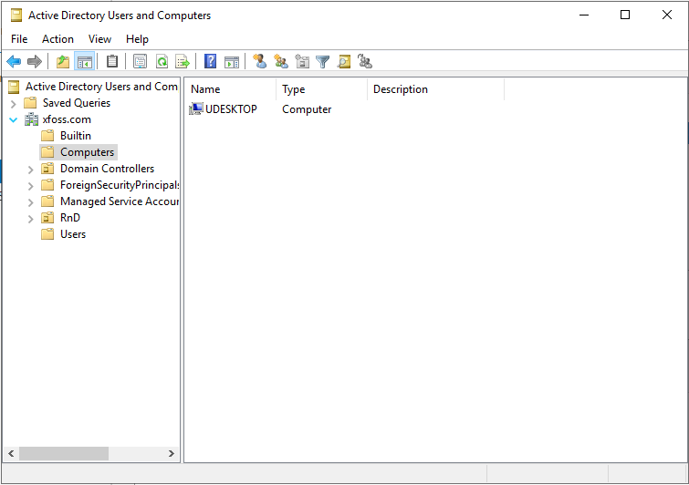

# 将Linux机器加入到AD

_本文以 Ubuntu 20.04为例，记录将 Linux 机器加入到 M$ AD的操作过程。_

## 00. 安装 SSSD 软件及工具

SSSD 是 **System Security Services Daemon** 的缩写。安装以下软件：

```bash
sudo apt install sssd-ad sssd-tools realmd adcli krb5-user
```

其中 `krb5-user` 是必须的，且需要修改 `/etc/krb5.conf` 文件，加入下面的配置：

```conf
[libdefaults]
    rdns = false
```

> **注**：对于 CentOS 7，需安装如下的这些软件包：

```console
$ sudo yum install sssd realmd oddjob oddjob-mkhomedir adcli samba-common samba-common-tools krb5-workstation openldap-clients policycoreutils-python -y
```

## 01. 主机名及主机名的解析

编辑文件 `/etc/hostname`，将主机名修改为 FQDN 样式（比如 `udesktop.xfoss.com`）。

通过 `hostname -f` 查看。同时在 Windows 服务器上加入对应的 `A` 记录。

## 02. 在 Linux 机器上配置有效的 DNS 服务器

安装 `resolvconf` 软件包，并启动 `resolvconf` 服务，修改 `/etc/resolvconf/resolvconf.d/head`配置文件（加入 `nameserver 192.168.153.131`, 其中 `192.168.153.131` 就是配置了 DNS 服务的 DC 服务器地址），然后运行 `sudo resolvconf -u` 更新配置。

```bash
sudo apt install resolvconf
sudo systemctl enable --now resolvconf.service
sudo vim /etc/resolvconf/resolv.conf.d/head
sudo resolvconf -u
```

> **注意**：在 CentOS 7 上没有 `resolvconf` 软件包，可修改 `/etc/resolv.conf`，然后使用命令 `$ sudo chattr +i /etc/resolv.conf` 将这个文件属性，设置为不可修改（immutable）。

## 03. 在 Linux 机器上配置时间服务

将配置了 NTP 服务的 DC 服务器，配置为 Linux 机器的 NTP 服务器。编辑文件：

```bash
sudo vim /etc/systemd/timesyncd.conf
```

修改为：

```conf
[Time]
NTP=dc.xfoss.com
FallbackNTP=ntp.ubuntu.com
```

## 04. 连接到 AD

### 04-01. 发现 Active Directory

运行命令（无需 `sudo`）：

```bash
realm discover xfoss.com
```

```bash
xfoss.com
  type: kerberos
  realm-name: XFOSS.COM
  domain-name: xfoss.com
  configured: no
  server-software: active-directory
  client-software: sssd
  required-package: sssd-tools
  required-package: sssd
  required-package: libnss-sss
  required-package: libpam-sss
  required-package: adcli
  required-package: samba-common-bin
```

在前面的配置都正确的情况下，就可以看这个有关即将加入的域的这些信息。注意这里的 `Configured: no`，只是告诉你尚未加入到这个域。

在加入到域之后，这个命令的输出如下所示：

```bash
xfoss.com
  type: kerberos
  realm-name: XFOSS.COM
  domain-name: xfoss.com
  configured: kerberos-member
  server-software: active-directory
  client-software: sssd
  required-package: sssd-tools
  required-package: sssd
  required-package: libnss-sss
  required-package: libpam-sss
  required-package: adcli
  required-package: samba-common-bin
  login-formats: %U@xfoss.com
  login-policy: allow-realm-logins
```

### 04-02. 加入到活动目录

要加入到活动目录，以 `sudo` 执行以下命令：

```bash
sudo realm join -U lenny.peng xfoss.com --os-name="`uname -o`" --os-version="`uname -rsv`" --install='/' --verbose
```

也可以使用 `Administrator` 账号，但测试不能使用 `lenny.peng@xfoss.com`这样的账号。其中 `lenny.peng` 有相应的 AD 管理权限。

这个命令将 Linux 机器加入到 AD 下的 `Computers` 之下，如下图所示:




> **注**：在 CentOS 7 下执行这个命令，会报错：

```console
$ sudo realm join -U lenny.peng xfoss.com --os-name="`uname -o`" --os-version="`uname -rsv`" --install='/' --verbose
 * Resolving: _ldap._tcp.xfoss.com
 * Performing LDAP DSE lookup on: 192.168.192.135
 * Successfully discovered: xfoss.com
Password for lenny.peng:
 * Assuming packages are installed
 * LANG=C /usr/bin/net -s /var/cache/realmd/realmd-smb-conf.XG63V1 -U lenny.peng ads join xfoss.com osName=GNU/Linux osVer=Linux 3.10.0-1160.80.1.el7.x86_64 #1 SMP Tue Nov 8 15:48:59 UTC 2022
 ! Failed to enroll machine in realm: Failed to execute child process “/usr/bin/net” (No such file or directory)
realm: Couldn't join realm: Failed to enroll machine in realm. See diagnostics.
```

> 解决方法：在 CentOS 7 上，执行 `$ sudo yum install samba-common-tools -y` 安装这个 `samba-common-tools` 软件包。
> 
> **注意**：似乎还应安装 `dconf-editor` 这个软件包。

要脱离 AD，以 `sudo` 模式，运行 `sudo realm leave xfoss.com`。

此时以普通用户运行 `realm list xfoss.com`，输出与 `realm discover xfoss.com` 的输出一致。

### 04-03. 配置自动创建用户主目录（Creating home directory automatically）

运行命令 `sudo pam-auth-update --enable mkhomedir`, 就可以在用户登录后，自动创建用户主目录。

> 创建出来的主目录的格式为： `/home/hailin.peng@xfoss.com`、`/home/lenny.peng@xfoss.com`

> **注意**：对于 CentOS 7，修改配置文件 `/etc/sssd/sssd.conf` 为：


```conf
[domain/xfoss.com]
use_fully_qualified_names = False
fallback_homedir = /home/%u
```

> 然后重启 `sssd`：`$ sudo systemctl restart sssd`。

（在 CentOS 7 上）用户登录的情况：

```console
$ ssh lenny.peng@192.168.192.134
lenny.peng@192.168.192.134's password:
Creating home directory for lenny.peng.
```

### 04-04. 对设置进行测试

> 可能需要需要重启系统，设置才能生效。

**测试发现，Linux下也是支持新用户首次登录修改密码的。在GUI登录下，直接修改密码后登录到桌面；但在SSH登录时，修改密码后会显示 `Connection to ulite.xfoss.com closed.` 之后需再次SSH登录。**

### 04-05. 关于 `ldap-utils`

`ldapsearch` 是 LDAP 实用工具之一。运行 `ldapsearch` 需要在域账号登录环境之下。否则会报错：

```bash
peng@uDesktop:~$ ldapsearch
SASL/GSSAPI authentication started
ldap_sasl_interactive_bind_s: Local error (-2)
        additional info: SASL(-1): generic failure: GSSAPI Error: Unspecified GSS failure.  Minor code may provide more information (No Kerberos credentials available (default cache: FILE:/tmp/krb5cc_1000))
```

此外，`ldapsearch` 的运行，还需要在 DNS 服务器上设置反向解析记录（Windows DNS 服务器设置十分简单）。

`ldapsearch` 命令的输出如下：

```bash
SASL/GSSAPI authentication started
SASL username: Lenny.Peng@XFOSS.COM
SASL SSF: 256
SASL data security layer installed.
...
```

### 04-06. 将 AD 中的用户，加入到 `sudoers` 组中

修改配置文件：`/etc/sudoers.d/sudoers` 如下：

```conf
%sudoers    ALL=(ALL)       ALL
```

并在 AD 中建立一个用户组 `sudoers`，把需要 `sudo` 权限的用户，加入到这个组中，那么这些用户将在 Linux 系统中得到 `sudo` 权限。

## 05. 后记

经测试，在 M$ AD 域控制器服务器关机时，以前曾登录过 Linux 机器的用户，可以继续登录，未曾登录过的用户，无法登录。说明登录凭据被保存在了 Linux 机器本地。

## 06. 补充

在 Ubuntu 上，会出现照上述步骤配置好后，无法使用 LDAP/AD 账号登录的情况，如下所示：

```log
Nov 30 14:19:15 fpga-sta sshd[7060]: pam_unix(sshd:auth): authentication failure; logname= uid=0 euid=0 tty=ssh ruser= rhost=10.12.10.96  user=leny.peng
Nov 30 14:19:15 fpga-sta sshd[7060]: pam_sss(sshd:auth): authentication success; logname= uid=0 euid=0 tty=ssh ruser= rhost=10.12.10.96 user=lenn.peng
Nov 30 14:19:15 fpga-sta sshd[7060]: pam_sss(sshd:account): Access denied for user lenny.peng: 4 (System error)
Nov 30 14:19:15 fpga-sta sshd[7060]: Failed password for lenny.peng from 10.12.10.96 port 52482 ssh2
Nov 30 14:19:15 fpga-sta sshd[7060]: fatal: Access denied for user lenny.peng by PAM account configuration [preauth]
```

这是一种妥协的处理办法是，将 `ad_gpo_access_control = permissive` 添加到 `/etc/sssd/sssd.conf` 配置文件的 `[domain/xfoss.com]` 小节，便可通过 LDAP/AD 登录了。

参考：[Debugging sssd login: pam_sss [...] System error](https://serverfault.com/q/872542)
