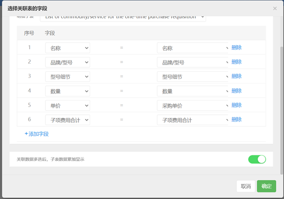
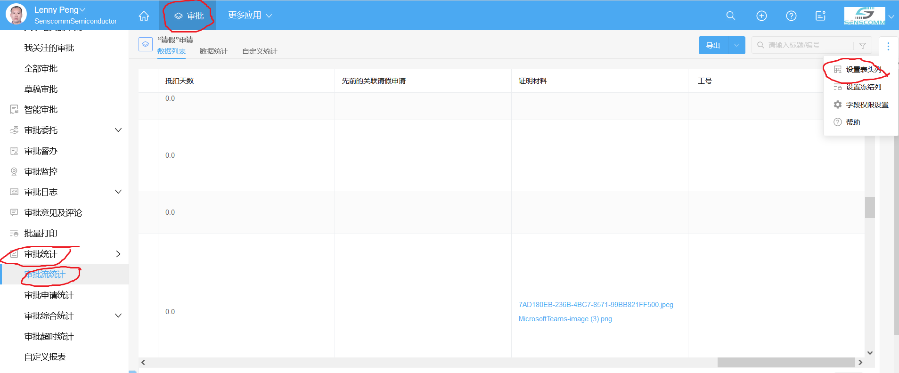

# 泛微eteams.cn应用构造备忘录

本文档记录 eteams.cn 配置中的注意点。

## “流程设计”中节点配置的“显示布局”

运用“显示布局”，可以配置流程中各节点，“操作者”对表单中各字段的“查看”与“编辑”权限。

## “明细子表”的合并

首先设置“关联审批”，然后插入一个 “明细子表”，再通过插入的子表中 “编辑子表” -> “选择关联子表的字段”，即可设置子表合并。

## “业务表单 - 规则库” 与 “审批流程 - 数据规则”

[规则库](https://eteams.cn/help/4528939060366202859) - 设计用于打通各个应用模块直接的数据，是各个应用模块之间数据交换的桥梁。

在PO流程完毕后，要建立库存表，可能会用到这个特性。

## "审批" -> "审批统计" -> "审批流统计" -> "设置表头列"

## 提醒邮件模板问题

发现在 Firefox 浏览器下，制作的模板无法渲染出来，在 Chrome 浏览器下没有问题。
