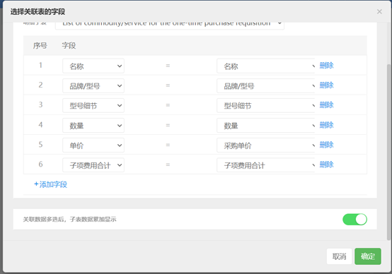
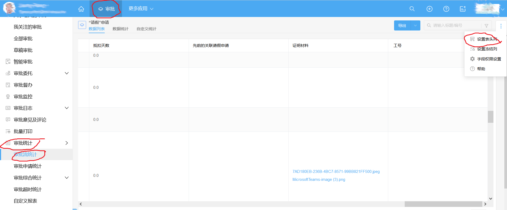

# 泛微eteams.cn应用构造备忘录

本文档记录 eteams.cn 配置中的注意点。

## 关于出差撤回与销假问题

可以制作一个销假流程，但出差只能撤回处理。

## “流程设计”中节点配置的“显示布局”

运用“显示布局”，可以配置流程中各节点，“操作者”对表单中各字段的“查看”与“编辑”权限。

## “明细子表”的合并

首先设置“关联审批”，然后插入一个 “明细子表”，再通过插入的子表中 “编辑子表” -> “选择关联子表的字段”，即可设置子表合并。




## “业务表单 - 规则库” 与 “审批流程 - 数据规则”

[规则库](https://eteams.cn/help/4528939060366202859) - 设计用于打通各个应用模块直接的数据，是各个应用模块之间数据交换的桥梁。

在PO流程完毕后，要建立库存表，可能会用到这个特性。

## "审批" -> "审批统计" -> "审批流统计" -> "设置表头列"



## 提醒邮件模板问题

发现在 Firefox 浏览器下，制作的模板无法渲染出来，在 Chrome 浏览器下没有问题。

## “出差” 流程撤销

“出差”流程没有像 “请假” 流程那样有对应的销假流程可以撤销出差申请，故撤销出差是在 “流程监控” 中干预到发起节点，或直接删除对应的出差流程。


## 表单中 “多级下拉选项” 中选项的比较


多级下拉选项中的选项，是通过 `一级选项 value 值,二级选项 value 值` 方式比较的，而无法通过选项文本直接比较。点开右侧 “组件设置” 中 “编辑选项模板”，就可以看到 “一级选项”、“二级选项” 的 `value 值`。拷贝这些 `value 值`，然后在其他组件的 “函数公式” 中使用。如下所示：

```javascript
IF({“报销单”应用流程.Expensetype}='847423556106584068,889769567236988935','','N')
```
