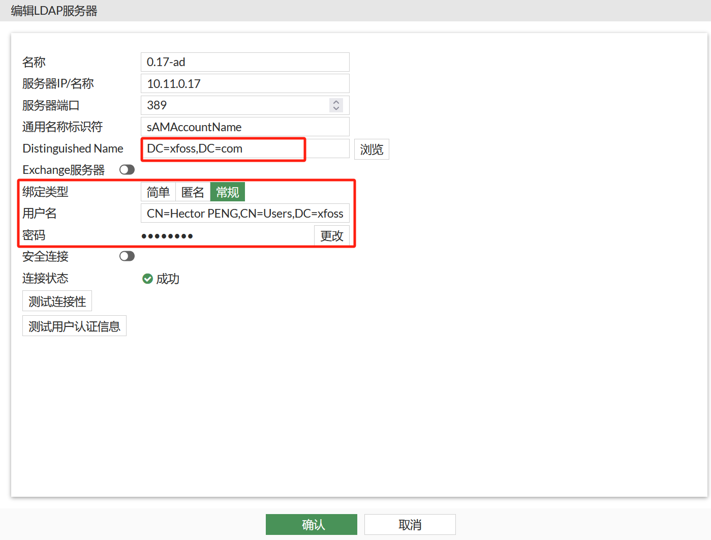

# 工作杂记

本文记录工作中的一些经验。


## `FortiGate` 经由 LDAP(M$ AD) 的用户认证


首先，在 “用户与认证” --> “LDAP” 下，“新建” 出一个 LDAP 实例。



其中：

-  “服务器IP/名称” 中填入 M$ AD 服务器 IP 地址；

- “通用名称标识符”中填入 `sAMAccountName`；

- “Distinguished Name” 中填入域的 DN；

- “用户名” 中填入域管理员的 DN；

可通过 “测试连接性” 和 “测试用户认证信息”，对所配置的 M$ AD LDAP 服务器进行测试。


随后，在 “用户与认证” -> “用户组” 中，可以通过 “新建”，或者在既有的用户组的 “远程组”，浏览到所配置 LDAP 服务器中的全部用户组。此时可根据需要，选择相应的用户组，作为可连接 FG VPN 的用户筛选依据。


## `FortiGate` 报错：`Credential or SSLVPN configuration is wrong. (-7200)`


*图 1 - `FortiGate` - `-7200` 报错*

AD 账户被禁用造成。


## 无法远程桌面到另一 Windows 终端的问题

由于该 Windows 开启了防火墙，导致其他计算机无法远程桌面控制此 Windows 计算机。并表现为从此 Windows 终端可 Ping 通远端计算机，但远端计算机无法 Ping 通此 Windows 计算机。*解决方法*：关闭此计算机的防火墙即可。


## 远程连接到 Linux 主机方案 - X2go

[X2Go - everywhere@home](https://wiki.x2go.org)

安装 X2Go 服务端：

```console
$ sudo add-apt-repository ppa:x2go/stable
$ sudo apt install x2goserver x2goserver-xsession
```

### 使用 X2go 无法连接到 Gnome-shell

原因：[The problem is with Gnome, installing Xfce works well.](https://unix.stackexchange.com/a/322350)

在较新版本的 Gnome 上（CentOS 7），需要安装 `gnome-flashback` 软件包，先要添加下面这个软件仓库：

```repo
[copr:copr.fedorainfracloud.org:yselkowitz:gnome-flashback]
name=Copr repo for gnome-flashback owned by yselkowitz
baseurl=https://download.copr.fedorainfracloud.org/results/yselkowitz/gnome-flashback/epel-7-$basearch/
type=rpm-md
skip_if_unavailable=True
gpgcheck=1
gpgkey=https://download.copr.fedorainfracloud.org/results/yselkowitz/gnome-flashback/pubkey.gpg
repo_gpgcheck=0
enabled=1
enabled_metadata=1
```

到文件 `/etc/yum.repos.d/yselkowitz-gnome-flashback-epel-7.repo`，再执行：`$ sudo yum install gnome-flashback -y`。

随后即可通过 `X2Go` 连接到 Gnome 桌面了。

### 安装 `mate`、`lxde` 与 `xfce4`

```console
$ sudo apt install ubuntu-mate-core mate-tweak lxde xfce4
```


## M$/Windows DHCP 服务器管理器

“设置” -> “Windows 设置” -> “应用” -> “可选功能” -> “添加功能” -> “RSAT: xxx” 组别

RSAT，Remote Server Administration Tools, 远端服务器管理工具


## AnyDesk `Aborted(core dumped)` 问题

该问题初步认为是由于安装 AnyDesk 时使用了 `$ sudo su -`，安装结束后未退出 `root` 用户，就运行了 `anydesk` 命令，在用户主目录下建立了 `.anydesk` 文件夹，所以因为权限原因，而报出 `Aborted(core dumped)` 错误。

解决办法即是删除主目录下的 `.anydesk` 文件夹。

参考：[Anydesk error: Aborted (core dumped) in Ubuntu 22.04](https://askubuntu.com/a/1413795`)


## 在开启 `hybrid` 的交换机端口下连接傻瓜交换机遇到终端数瓶颈

**更新**：此问题疑似与在使用傻瓜交换机（类似集线器）时，广播域中存在多个 DHCP 服务器相关，导致接入主机无法正常获取到 IP 地址，应使用可管理交换机，配置 `ip helper-address`，并在端口上配置抑制 DHCP 服务器报文。


此问题出现在将一台 Linux 终端连接到傻瓜交换机上时，终端可以获取到 IP 地址，但没有流浪，无法 `ping` 通网关，导致无法使用。后续应调查此问题。


## `mdbook` 增加 `hljs` 语言模块

- 将 `default.min.css`、`highlight.min.js` 及语言模块文件，如 `tcl.min.js` 下载到 `theme` 文件夹；

- 修改 `book.toml` 文件，添加上述三个文件：

```toml
[preprocessor.pagetoc]
[output.html]
additional-css = ["theme/pagetoc.css", "theme/default.min.css"]
additional-js  = ["theme/pagetoc.js", "theme/highlight.min.js", "theme/tcl.min.js"]
```

- 修改 `theme/index.hbs`，包含上述三个文件。

```html
...
    <!-- Highlight.js Stylesheets -->
    <link rel="stylesheet" href="{{ path_to_root }}/theme/default.min.css">
...
      <script src="{{ path_to_root }}theme/highlight.min.js"></script>
      <script src="{{ path_to_root }}theme/tcl.min.js"></script>

```

## `ethtool`

`ethtool` 用于查询及控制网络设备驱动程序和硬件设置，尤其是有线以太网设备。


```console
~ ethtool enp8s0
Settings for enp8s0:
        Supported ports: [ TP MII ]
        Supported link modes:   10baseT/Half 10baseT/Full
                                100baseT/Half 100baseT/Full
                                1000baseT/Full
        Supported pause frame use: Symmetric Receive-only
        Supports auto-negotiation: Yes
        Supported FEC modes: Not reported
        Advertised link modes:  10baseT/Half 10baseT/Full
                                100baseT/Half 100baseT/Full
                                1000baseT/Full
        Advertised pause frame use: Symmetric Receive-only
        Advertised auto-negotiation: Yes
        Advertised FEC modes: Not reported
        Link partner advertised link modes:  10baseT/Half 10baseT/Full
                                             100baseT/Half 100baseT/Full
                                             1000baseT/Full
        Link partner advertised pause frame use: Symmetric Receive-only
        Link partner advertised auto-negotiation: Yes
        Link partner advertised FEC modes: Not reported
        Speed: 1000Mb/s
        Duplex: Full
        Port: Twisted Pair
        PHYAD: 0
        Transceiver: internal
        Auto-negotiation: on
        MDI-X: Unknown
Cannot get wake-on-lan settings: Operation not permitted
        Link detected: yes
```


## 终端 `http_proxy` 与 `https_proxy` 环境变量

可以 `export` 这两个环境变量，临时让该终端下的程序，经由指定的代理访问网络。比如：


```console
> export http_proxy=socks5://localhost:10080
> export https_proxy=socks5://localhost:10080
```

就可以让该终端下的程序，使用经由 SSH 建立的 SOCKS5 `10080` 端口代理。


## VNC


1. 启动


VNC 的启动，是基于每个用户的。在用 SSH 登录了主机后，运行命令：

```console
$ vncserver :x
```

即可启动该用户下的 VNC 服务器，随后即可通过 VNC Viewer 连接到该主机。过程中 VNC 会询问密码。其中 `x` 是 VNC 的端口号。


2. 查看 VNC 是否启动


`ps -ef | grep vnc`


3. 关掉 VNC


`$ vncserver -kill :x`

其中 `x` 是启动时用到的 VNC 端口号。


4. 修改 VNC 分辨率


在 VNC 的配置文件 `/etc/vnc/xstartup` 末尾，添加行：

`xrandr -s 1280x800`

重启 VNC 服务器，就应看到新分辨率生效。

## Windows 上挂载 SMB 文件夹

- 首先找到挂载点，比如 `\\10.11.0.6\data`，然后输入此挂载点所需的用户名密码；

- “不允许一个用户使用一个以上用户名与服务器或共享资源的多重连接。中断与此服务器或共享的所有连接，然后再试一次。” 就是说，在一台 Windows 中断上，只能使用一个用户名和密码，连接 SMB 服务器上的一个或多个文件夹。
