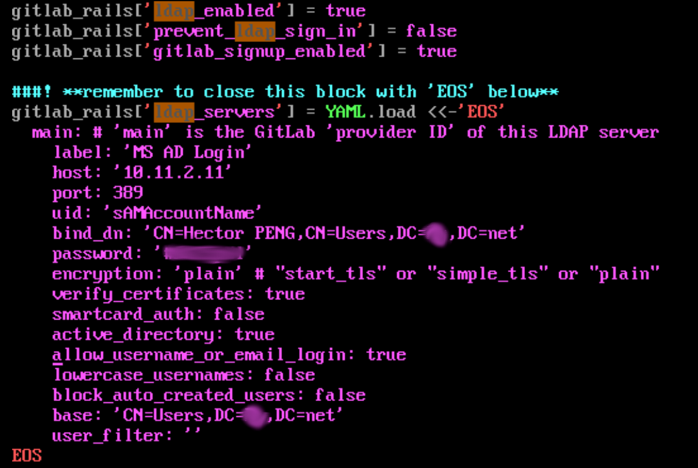

# GitLab CE 部署笔记

## 安装

这里记录在 CentOS 7 上，安装部署 GitLab CE 的步骤。


> **注意**: 要开启 `80` 与 `443` 端口：

```console
# firewall-cmd --zone=public --add-service=http --permanent
# firewall-cmd --zone=public --add-service=https --permanent
```

1. 安装、更新 CentOS 7；

    - `sudo yum -y update`；
    - `sudo yum -y install bash-completion bash-completion-extras`

2. 参考 [Official Linux Package](https://about.gitlab.com/install/#centos-7) 安装 GitLab CE；

    > **注意**：
    >
    > 列出软件包可用版本的命令：
    > 
    > `yum list gitlab-ce --showduplicates | sort -r`

    在后面恢复 GitLab-CE 时，需严格按照备份时 gitlab-ce 的版本安装 GitLab-CE。

3. 配置相关证书；

    - LDAP（M$ AD）导出的 PEM 证书，用于 GitLab CE 与 AD 服务器之间的秘密通信；

        ```console
        $ sudo cp gitlab-configs/certnew.pem /etc/pki/ca-trust/source/anchors/
        $ sudo update-ca-trust
        $ sudo cp gitlab-configs/certnew.pem /etc/gitlab/ssl/
        ```

    - NGINX 的证书（要从根证书，生成 nginx web 主机（gitlab.xfoss.com）的证书）；

        ```console
        $ sudo cp gitlab-configs/gitlab.crt /etc/gitlab/ssl
        $ sudo cp gitlab-configs/gitlab-rsa.key /etc/gitlab/ssl
        ```


4. 拷贝 `gitlab.rb`，并编辑，然后执行 `$ sudo gitlab-cfg reconfigure` 重新配置。

    ```console
    $ sudo cp ~/gitlab-configs/gitlab.rb /etc/gitlab/
    $ sudo gitlab-cfg reconfigure
    ```


## 经由 MS AD 的用户认证

主要是开启  `ldap_enabled`、`prevent_ldap_sign_in` 等选项，并提供 `ldap_servers` 连接参数。注意连接参数是以 YAML 格式提供，因此要保持这些参数的缩进量。





## 配置的备份

参考 [备份与恢复 Omnibus GitLab 的配置](https://docs.gitlab.com/omnibus/settings/backups.html)


```console
sudo gitlab-ctl backup-etc --backup-path <DIRECTORY>
```

将配置备份到指定位置。

编辑 root 用户的 cron 表，来创建一种定时的应用备份：

```console
$ sudo crontab -e -u root
```

```cron
15 04 * * 2-6  gitlab-ctl backup-etc && cd /etc/gitlab/config_backup && cp $(ls -t | head -n1) /secret/gitlab/backups/
```


## 数据库与代码仓库的备份


1. 修改 `/etc/gitlab/gitlab.rb` 中的 `backup_path` 配置项

    ```ruby
    gitlab_rails['backup_path'] = "/backup"
    ```

2. 运行备份命令

    ```console
    $ sudo gitlab-backup create

    $ sudo gitlab-backup create INCREMENTAL=yes # 增量备份
    ```

> **注**：这里的 `/backup` 是经由 `/etc/fstab` 挂载到系统的 NFS 存储空间

> **注**：CentOS 7 中，需要安装安装 `yum install nfs-utils nfs-utils-lib`。

> 其所有者为 `git:root`，权限为 `755`


> **注意**：CentOS 7 上假设 NFS 服务器要开启 SeLinux 规则，并在防火墙上放行 NSF 服务：

    ```console
    setsebool -P nfs_export_all_rw 1
    setsebool -P nfs_export_all_ro 1


    firewall-cmd --permanent --add-service=nfs
    firewall-cmd --permanent --add-service=mountd
    firewall-cmd --permanent --add-service=rpc-bind
    firewall-cmd --reload
    ```

## 使用要点

### GitLab 命令行：Rails console

```console
$ sudo gitlab-rails console
```

### GitLab 控制台修改用户口令

```console
irb(main):001:0> user = User.find_by_username 'root'
=> #<User id:1 @root>
irb(main):002:0> new_password = ::User.random_password
=> "wm-KRAmuoCJDgTSNMHBbGVuyte57DiNWu54R1nnAfALsbG-iVJ_8rk35fiBzhZJb9-Zk7sAVrNLLYt1NgbCk3zHCstWxcH2fXyEWn6ygd6g13STcx_nDWk89a...
irb(main):003:0> user.password = new_password
=> "wm-KRAmuoCJDgTSNMHBbGVuyte57DiNWu54R1nnAfALsbG-iVJ_8rk35fiBzhZJb9-Zk7sAVrNLLYt1NgbCk3zHCstWxcH2fXyEWn6ygd6g13STcx_nDWk89a...
irb(main):004:0> user.password_confirmation = new_password
=> "wm-KRAmuoCJDgTSNMHBbGVuyte57DiNWu54R1nnAfALsbG-iVJ_8rk35fiBzhZJb9-Zk7sAVrNLLYt1NgbCk3zHCstWxcH2fXyEWn6ygd6g13STcx_nDWk89a...
irb(main):005:0> user.save!
=> true
```

> **注意**：初始安装似乎应进行登录，然后在恢复配置文件。此举为避免在 web 页面修改配置时，报出 `http 500` 错误。

### 数据库与代码仓库的恢复

```console
# pre-requisites
$ sudo gitlab-ctl stop puma
$ sudo gitlab-ctl stop sidekiq
# Verify
$ sudo gitlab-ctl status
$ sudo gitlab-backup restore BACKUP=11493107454_2018_04_25_10.6.4-ce
# post-check
$ sudo gitlab-ctl reconfigure
$ sudo gitlab-ctl restart
$ sudo gitlab-rake gitlab:check SANITIZE=true
```

> **注意**：恢复配置文件后，在网页端修改一些设置时，会报出 `http 500` 错误。这样的报错在恢复了数据库及代码仓库后，便会消失。


## GitLab CE 主从实时同步


参考：

1. [gitlab搭建+主从实时同步](https://www.jianshu.com/p/d94d9f1cf744)

2. [Setting up and switching PostgreSQL active/standby environment on Linux](https://pankajconnect.medium.com/setting-up-and-switching-postgresql-active-standby-environment-on-linux-6af1ce660846)

这种 GitLab CE 两个实例实时同步，主要通过 [lsyncd](https://github.com/lsyncd/lsyncd) 实现 `/var/opt/gitlab` 目录同步，以及配置 [PostgreSQL](https://www.postgresql.org/) 的复制实现数据库同步，而达到他们实时同步目的。


### `lsyncd` 部分

1. 修改 `/etc/sysconfig/lsyncd`:

> *注*：`lsyncd` 的配置文件 `/etc/lsyncd.conf.lua` 本身就是 Lua 脚本程序，这样修改后在 Vim 中打开时，会语法高亮显示。

    ```console
    $  cat /etc/sysconfig/lsyncd
    LSYNCD_OPTIONS="/etc/lsyncd.conf.lua"
    ```


2. 将主机 `root` 用户 SSH 公钥，添加到从机 `/root/.ssh/authorized_keys` 文件

    首先生成公钥：

    ```console
    # ssh-keygen -t rsa
    ```

    在将公钥传输到从机：

    ```console
    # ssh-copy-id root@10.12.7.125
    ```


3. `/etc/lsyncd.conf.lua`

    ```lua
    settings {
        logfile ="/var/log/lsyncd/lsyncd.log",
        statusFile ="/var/log/lsyncd/lsyncd.status",
        inotifyMode = "CloseWrite",
        -- 同时最大起的rsync进程数，一个rsync同步一个文件
        maxProcesses = 8,
    }

    -- 远程目录同步，rsync模式 + ssh shell
    sync {
        default.rsync,
        -- 源目录，路径使用绝对路径
        source = "/var/opt/gitlab",
        -- 目标目录
        target = "root@10.12.7.125:/var/opt/gitlab/",
        -- 上面target，注意如果是普通用户，必须拥有写权限
        exclude = {
            "backups",
            "gitlab-ci",
            "sockets",
            "gitlab.yml",
            "redis",
            "postgresql/data",
        },
        -- 统计到多少次监控事件即开始一次同步
        maxDelays = 5,
        -- 若30s内未出发5次监控事件，则每30s同步一次
        delay = 30,
        -- init = true,
        rsync = {
            -- rsync可执行文件
            binary = "/usr/bin/rsync",
            -- 保持文件所有属性
            archive = true,
            -- 压缩传输，是否开启取决于带宽及cpu
            compress = true,
            -- 限速 kb／s
            bwlimit   = 2000
            -- rsh = "/usr/bin/ssh -p 22 -o StrictHostKeyChecking=no"
            -- 如果要指定其它端口，请用上面的rsh
        }
    }
    ```

这时运行 `$ sudo systemctl restart lsyncd` 就可以将主机与从机的 `/var/opt/gitlab` 目录同步了。接下来配置 PostgreSQL 的主从复制。


### PostgreSQL 主从复制

GitLab CE 集成的 PostgreSQL 已建立了复制账号 `gitlab_replicator`，可经由以下命令操作查看到：

```console
$ sudo su - gitlab-psql
Last login: Wed Dec  7 14:35:49 CST 2022 on pts/0
-sh-4.2$ psql -h /var/opt/gitlab/postgresql -d gitlabhq_production
gitlabhq_production=# select * from pg_roles;
```

**修改认证文件 `pg_hba.conf`**

```console
$ sudo su -
# cd /var/opt/gitlab/postgresql/data
# vim pg_hba.conf
```

在该文件底部，加入下面这行：

```conf
host    replication gitlab_replicator   10.12.7.125/32 trust
```

然后修改 GitLab CE 下 PostgreSQL 配置文件 `/var/opt/gitlab/postgresql/data/postgresql.conf`，修改下面这些配置项：


```conf
#监听服务器
listen_addresses = '*'

#主从设置为热备模式，流复制必选参数, [minimal, replica, logical]，务必设置高于 replica 
wal_level = replica

#流复制允许的连接进程，一般同standby数量一致
max_wal_senders = 10

#流复制在没有基于文件的连续归档时，主服务器可能在备机收到WAL日志前回收这些旧的WAL，此时备机需要重新从一个新的基础备份初始化；可设置wal_keep_segments为一个足够高的值来确保旧的WAL段不会被太早重用；1个WAL日志为16MB，所以在设置wal_keep_segments时，在满足空间的前提下可以尽量设置大一些
wal_keep_size = 64

#流复制超时时间
wal_sender_timeout = 60s

max_replication_slots = 8
```

或者将下面的配置，放置于 `/etc/gitlab/gitlab.rb` 中。

```conf
postgresql['listen_addresses'] = '192.168.192.138'
postgresql['wal_level'] = 'logical'
postgresql['max_wal_senders'] = 16
postgresql['wal_log_hints'] = 'on'
postgresql['max_connections'] = 512
postgresql['wal_keep_size'] = 64
# 经测试，这个配置项不生效
# postgresql['wal_sender_timeout'] = 60000
postgresql['max_replication_slots'] = 8
# 这里要把主从两个 IP 地址都加进去，以便后面的原主机数据恢复
postgresql['trust_auth_cidr_addresses'] = ['192.168.192.137/32', '192.168.192.138/32', '127.0.0.1/32']
```

> **参考**：[PostgreSQL 主从复制](https://blog.51cto.com/suncj/5102637)

运行以下命令，可以查看到 `max_replication_slots` 等一些参数：

```console
$ sudo su - gitlab-psql
-sh-4.2$  psql -h /var/opt/gitlab/postgresql -d gitlabhq_production
gitlabhq_production=# show max_replication_slots;
gitlabhq_production=# select * from pg_replication_slots;
```


随后重启 GitLab CE 主实例下的 PostgreSQL：

```console
$ sudo gitlab-ctl restart postgresql
```

### PostgreSQL 从库配置

**备份主库的数据**

备份之前要先停止主库的 `lsyncd` 服务，否则会同步主库数据，清空 data 目录。

```console
$ sudo systemctl stop lsyncd
```

运行 `/opt/gitlab/embedded/postgresql/13/bin` 中的 `pg_basebackup` 进行初始备份：

```console
# pg_basebackup -h 10.12.7.121 -p 5432 -U gitlab_replicator -Fp -Xs -Pv -R -D /var/opt/gitlab/postgresql/data/
```

修改 `/var/opt/gitlab/postgresql/data` 目录所有者：

```console
$ sudo chown -R gitlab-psql:root /var/opt/gitlab/postgresql/data/
```

修改 `/var/opt/gitlab/postgresql/data` 目录下的 `standby.signal` 文件为：

```conf
standby_mode = 'on'
```

修改 `/var/opt/gitlab/postgresql/data` 下的 `postgresql.conf` 配置文件，使其包含以下配置：

```conf
# 连接到主库信息
primary_conninfo = 'host=10.12.7.121 port=5432 user=gitlab_replicator'

# 同步到最新数据
recovery_target_timeline = 'latest'

hot_standby = on
# 可选，流复制最大延迟
max_standby_streaming_delay = 30s

# 可选，从向主报告状态的最大间隔时间
wal_receiver_status_interval = 10s

# 可选，查询冲突时向主反馈
hot_standby_feedback = on

##默认参数，非主从配置相关参数，表示到数据库的连接数，一般从库做主要的读服务时，设置值需要高于主库
max_connections = 2048
```

这里的 `max_connections` 要配置为大于或等于主库上的 `max_connections`，否则数据库会报错。

> **注意**：此时重启 PostgreSQL `sudo gitlab-ctl start postgresql`，查看其日志：`# less /var/log/gitlab/postgresql/current` 会发现以下报错：

```log
2022-12-12_08:36:01.81260 FATAL:  could not connect to the primary server: invalid connection option "sslsni"
```

> 原因是在 `/var/opt/gitlab/postgresql/data/postgresql.auto.conf` 中，有 `sslsni` 设置项，删除此文件中的配置行（先停止 `postgresql`，再删除，然后在启动 `postgresql`）：

```console
# gitlab-ctl stop postgresql
# rm -rf /var/opt/gitlab/postgresql/data/postgresql.auto.conf
# gitlab-ctl start postgresql
```

### 将备机 PostgreSQL 从热备状态，转换为活动（生产）状态

```console
$ sudo su - gitlab-psql
-sh-4.2$ cd /opt/gitlab/embedded/postgresql/13/bin
-sh-4.2$ ./pg_ctl promote -D /var/opt/gitlab/postgresql/data/
# 检查新的主节点状态
-sh-4.2$ pg_controldata -D /var/opt/gitlab/postgresql/data | grep cluster
Database cluster state:               in production
```

> **注**：运行 `./pg_ctl promote` 命令后，会删除 `standby.signal` 文件。

### 将原主库设置为备机

```console
$ sudo su - gitlab-psql
-sh-4.2$ cd /opt/gitlab/embedded/postgresql/13/bin
-sh-4.2$ ./pg_rewind --target-pgdata /var/opt/gitlab/postgresql/data/ \
--source-server='host=192.168.192.137 port=5432 dbname=gitlabhq_production' \
--progress --debug -n
```

## GitLab 升级


查看 GitLab 版本：


```console
cat /opt/gitlab/embedded/service/gitlab-rails/VERSION
```


参考：[Gitlab的升级（9.2.2升级到11.10.4）](https://blog.csdn.net/wc1695040842/article/details/89925246)


