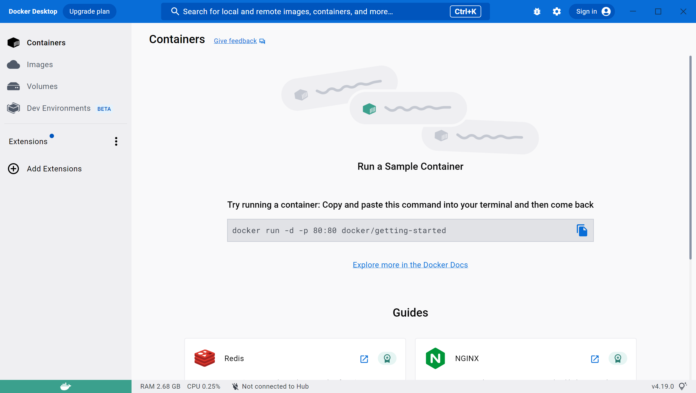

# M$ Win 系统管理笔记

Win 系统使用心得与经验记录。

## 本地 AD 密码同步到 Azure Ad 的问题

本地修改密码后，应等待 5 分钟到本地 AD 密码同步到 Azure AD 后，再登录激活 Office365。

## Wins 安装过程中，激活码的问题

微软有专门的 [KMS Client Setup Keys](https://learn.microsoft.com/zh-cn/windows-server/get-started/kms-client-activation-keys)。

## Win11 22h2 安装过程中跳过 “Let's connect you to a network”


在这个界面，按下 `Shift + F10`，于命令行中输入 `OOBE\BYPASSNRO`，之后机器将重启，且 out-of-box eperience, OOBE 将再次启动。

## Win 系统下软件安装的几种方式

这里要讨论的，并非习以为常的经由下载安装程序并运行，或是从应用商店 App Store 安全软件。而是一些另类的软件安装方式。

### `chocolatey.exe` 方式

[chocolatey.org](https://chocolatey.org)，提出 Win 系统包管理器的概念，并声称其为 “现代的软件自动化”。实际使用起来，也较为方便。

```powershell
PS C:\Windows\system32> choco help
Chocolatey v1.1.0
This is a listing of all of the different things you can pass to choco.

DEPRECATION NOTICE

The shims `chocolatey`, `cinst`, `clist`, `cpush`, `cuninst` and `cup` are deprecated.
We recommend updating all scripts to use their full command equivalent as these will be
removed in v2.0.0 of Chocolatey.

Options and Switches

 -v, --version
     Version - Prints out the Chocolatey version. Available in 0.9.9+.

Commands

 * find - searches remote or local packages (alias for search)
 * list - lists remote or local packages
 * search - searches remote or local packages
 * help - displays top level help information for choco
 * info - retrieves package information. Shorthand for choco search pkgname --exact --verbose
 * install - installs packages using configured sources
 * pin - suppress upgrades for a package
 * outdated - retrieves information about packages that are outdated. Similar to upgrade all --noop
 * upgrade - upgrades packages from various sources
 * uninstall - uninstalls a package
 * pack - packages nuspec, scripts, and other Chocolatey package resources into a nupkg file
 * push - pushes a compiled nupkg to a source
 * new - creates template files for creating a new Chocolatey package
 * sources - view and configure default sources (alias for source)
 * source - view and configure default sources
 * config - Retrieve and configure config file settings
 * feature - view and configure choco features
 * features - view and configure choco features (alias for feature)
 * setapikey - retrieves, saves or deletes an apikey for a particular source (alias for apikey)
 * apikey - retrieves, saves or deletes an apikey for a particular source
 * unpackself - re-installs Chocolatey base files
 * export - exports list of currently installed packages
 * template - get information about installed templates
 * templates - get information about installed templates (alias for template)


Please run chocolatey with `choco command -help` for specific help on
 each command.
```

### MSYS2 方式

> MSYS2 亦可经由 `choco.exe` 加以安装。

> [msys2.org](https://msys2.org): **MSYS2** 是为构建、安装及运行原生 Windows 软件的易于上手环境，而提供的一些工具与库的集合。

> 其包含了叫做 `mintty` 的一个命令行终端、`bash`、诸如 `git` 及 `subversion, svn` 等版本管理工具，以及像是 `tar` 与 `awk`，甚至像 `autotools` 这样的构建系统，全部都是基于修改版的 [`Cygwin`](https://cygwin.com/)。


### `scoop.sh` 方式

[scoop.sh](https://scoop.sh) 是另一个 Windows 的命令行安装程序。

Scoop 从命令行中安装咱们所知道和喜爱的程序，而且摩擦最小。他：

- 消除权限弹出窗口
- 隐藏 GUI 向导式安装程序
- 防止安装大量程序造成 `PATH` 污染
- 避免因安装和卸载程序而产生的意外副作用
- 自动查找并安装依赖项
- 自行执行所有额外的设置步骤以获得工作的程序


## 删除用户配置文件

在删除 Win 系统用户时，除了要在 “计算机管理” 中删除用户，还要删除用户配置文件。有两种方式：

- 前往 `C:/Users/` 目录，删除对应用户名的文件夹；
- “我的电脑” -> “属性” -> "高级系统设置" -> “用户配置文件” -> “设置”

首选第二种方式；因为第一种删除文件夹的方式，可能出现权限问题删除不了，而第二种方式则没有这方面的问题。


## AD 下用户证书申请与导出


### 申请新证书


在 “管理控制台” （按下 `Win + R` 输入 `mmc` 打开）中，“文件” -> “添加/删除管理单元” -> “证书” -> “我的用户账户”，在 “个人” 上点击右键，选择 “所有任务” -> “申请新证书”


### 导出证书

需要选择 “导出私钥” 选项，必要时为证书设置密码。


## “Internet 选项” 中 SSL/TLS 相关设置被修改的问题

参考：

1. [IE高级配置中支持的SSL/TLS协议对应注册表值](https://blog.csdn.net/dong123ohyes/article/details/127983040)
2. [Turn off encryption support](https://admx.help/?Category=InternetExplorer&Policy=Microsoft.Policies.InternetExplorer::Advanced_SetWinInetProtocols)


Win 系统中 “Internet 选项” 中，SSL/TLS 设置不当，会导致无法连接到相关服务。有的时候这些设置会被未知程序修改。可在 “管理员终端，Windows Powershell(Admin)” 里，运行注册表命令快速设置。

```powershell
reg add "HKCU\Software\Microsoft\Windows\CurrentVersion\Internet Settings" /v SecureProtocols /t REG_DWORD /d 2728 /f
```

其中的 `2728` 是表示 SSL/TLS 设置组合的代码，不同组合有不同的代码。


## 使用 `sshfs-win` 映射网络位置

参考：[winfsp/sshfs-win](https://github.com/winfsp/sshfs-win)

安装 `sshfs-win`：

```powershell
choco install -y sshfs
```

或

```powershell
winget install WinFsp.WinFsp; winget install SSHFS-Win.SSHFS-Win
```

然后映射一个网络驱动器到指定位置：

```uri
\\sshfs\REMUSER@HOST[\PATH]
```

## Windows 下 Docker 运行的一个问题

Windows 系统上通过运行：

```powershell
choco install -y docker-for-windows
```

即可安装 Docker 环境。

报出：

```powershell
> docker image ls -a
error during connect: in the default daemon configuration on Windows, the docker client must be run with elevated privileges to connect: Get "http://%2F%2F.%2Fpipe%2Fdocker_engine/v1.24/images/json?all=1": open //./pipe/docker_engine: The system cannot find the file specified.
```

此问题在 [docker: error during connect: In the default daemon configuration on Windows, the docker client must be run with elevated privileges to connect](https://stackoverflow.com/questions/67160140/docker-error-during-connect-in-the-default-daemon-configuration-on-windows-th) 上有讨论，并按照 [这个帖子](https://stackoverflow.com/a/75159317) 操作并重启计算机后，即可解决。所需执行的操作如下（均需在管理员终端下运行）：

1. 更新 `wsl` 内核，显然这是必须的，因为 `docker` 需要他，而他在默认情况下是不安装的：

```powershell
wsl --update
```

2. 运行下面的命令：

```powershell
& 'C:\Program Files\Docker\Docker\DockerCli.exe' -SwitchDaemon
```

重启系统后，Docker Desktop 会随系统启动自动运行。


