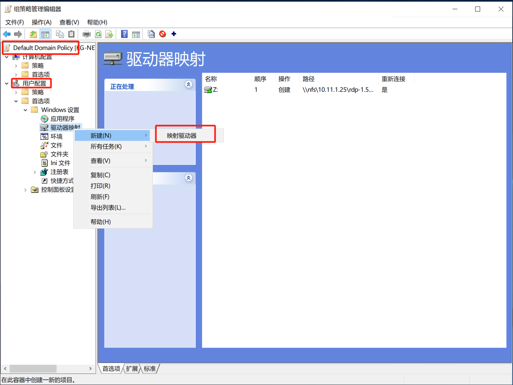

# M$ Win 系统管理笔记

Win 系统使用心得与经验记录。


## Windows 不能打开两个共享文件夹问题


运行一下命令：


```cmd
net stop workstation /y
net start workstation
```


> **参考**：[Multiple connections to a server or shared resource by the same user, using more than one user name, are not allowed](https://stackoverflow.com/a/37728594)


## 远程桌面 RDP 显示异常问题


昨天（2024.7.9) 有用户反应，他的远程桌面文字、图标偏大（与其他同样用户相比），影响使用。远程桌面的分辨率是无法设置的，故与此无关。后发现该用户 Windows(10) 未激活，出于对未激活状态感受不佳的原因，遂将该系统激活。然后打开远程桌面，文字、图标偏大的问题消失了！.......


**结论**：在 Windows 未激活的情况下，远程桌面会出现异常。


## 为 Windows 所有用户挂载 NFS 存储


首先，挂载 NFS 存储的 Windows 命令为（安装了 [`winfsp/nfs-win`](https://github.com/winfsp/nfs-win) 后）。


```console
net use z: \\nfs\10.11.1.25\rdp-1.50_share
```


与之相反，删除此挂载的命令为：


```console
net use z: /del /y
```


可通过下面的 `.bat` 脚本，实现脚本化的挂载与卸载。


```bat
@echo off
if not exist z:\ (net use z: \\nfs\10.11.1.25\rdp-1.50_share )
```


```bat
@echo off
if exist z:\ (net use z: /del /y )
```


而要实现此 NFS 网盘的自动挂载，可通过在域控制器上，“服务器管理器” -> “工具” -> “组策略管理”。


在 `Default Domain Policy` 上点击右键，选择 “编辑(E)”，对其进行编辑。


并在接下来的“组策略管理编辑器”中，新建出“映射驱动器”。




编辑“映射驱动器”的属性，如下所示。


> **注意**：这里的 `//nfs/10.11.1.25/rdp-1.50_share`，需要首先安装 `nfs-win` 软件。


参考：

- [【Windows Server 2019】组策略的配置与管理——配置基于域的组策略（下）进阶配置示例](https://blog.csdn.net/NOWSHUT/article/details/108425415)


## Windows 11 23H2 中，打开 “网络连接（Network Connections）” 的方式


新版本的 Windows 11 中，已经无法从“设置”，访问到“网络连接”。要打开“网络连接”，需如下操作：


- 按下 "Win + Q"

- 输入 `ncpa.cpl`，按回车打开 “网络连接” 窗口


## Windows 11 （未激活？）无法登录系统

今天收到用户 Windows 11 疑似因未激活，在重启时需登录 Microsoft 账号而卡住无法登录的情况。在卡住时，按下 `Ctrl-Alt-Del`，会调出 “任务管理器”界面，点击 “注销” 后，会来到登录界面，此时可用本地账号登录。


## Windows 家庭版创建账号


按下 Win+R，输入 `control userpasswords2`，在打开的 “用户账户” 界面中，添加普通用户或管理员的用户。


## AD 域服务器多个子网与路由问题


参考：[11.4. Creating a Subnet](https://www.oreilly.com/library/view/active-directory-cookbook/0596004648/ch11s05.html)


1. 打开 “Active Directory 站点和服务管理单元”， the Active Directory Sites and Services snap-in；


2. 右击 `Subnets` 容器，并选择新建子网；

3. 输入地址和掩码，并在随后选择该子网是哪个站点的一部分；

4. 点击 `OK`。


注意：一台服务器接入多个网卡后，会出现路由问题。此时，需要使用 `route` 命令，删除默认路由并建立正确的默认永久路由。

```powershell
route delete 0.0.0.0
route add 0.0.0.0 mask 0.0.0.0 10.11.0.254 -p
```


## `C:\Windows\system32\control.exe` 权限问题（Server 2019）

参考：[Windows Server 2019 Standard - Active Directory Domain Services](https://learn.microsoft.com/en-us/answers/questions/490998/windows-server-2019-standard-active-directory-doma?page=2)


在修改网卡参数时，会碰到这个问题。


解决办法：


前往 `Local Security Policy` -> `Local Policies` -> `Security Options` -> `User Account Control: Admin Approval Mode for the Built-in Administrator account`, 启用这个选项。重启服务器并再度尝试，便可修复此问题。

`本地安全策略` -> `本地策略` -> `安全选项` -> `用户账户控制：用于内置管理员账户的管理员批准模式`。


## `W32Time` 服务无法启动

使用 `net start w32time`，或在 `服务Services` 管理程序中启动 `W32Time` 服务时，可能遇到该服务无法启动的问题。原因是 windows time 服务失效。

修复：在提升权限的 CMD 窗口中，键入 `w32tm /register`，将输出：`W32Time 成功注册`。此时再使用 `net start "windows time"`，或 `net start w32time` 命令，启动该服务。

参考：[windows time 服务无法启动解决方法：`w32tm /register`](https://blog.51cto.com/56214415/391810)


## Windows DNS 解析异常的一种情况


今天（2024-03-02），在手动设置了一个 IPv4 的 DNS 服务器情况下，在终端中运行 `nslookup dc.xfoss.com`，仍未能得到正确的 IP 地址。

发现 Windows 系统会在手动设置了 IPv4 的地址情况下，仍然使用 IPv6 的 DNS 服务器，去解析域名。而在关掉系统的 IPv6 协议后，系统便能通过手动设置的 IPv4 DNS 服务器地址，去解析域名。


## 通过 `Internet Archive: Wayback Machine` 时光机，找到旧版 VS Code

今天（2024-02-20）要在一台 Windows Server 2012 R2 机器上，安装 system-wide 的 VS Code，但新版本的 VS Code System Installer（VS Code 安装程序，分 User Installer 和 System Installer），已经不支持 Server 2012 R2 了。因此要找到支持该 Windows 版本的 System Installer。

通过 Google 就很难找到，偶然想到互联网档案馆上，应该有存档。于是就使用互联网档案馆的

- 时光机，[Internet Archive: Wayback Machine](https://archive.org/web/)

查看 VS Code 下载页面：`https://code.visualstudio.com/Download` 的历史版本，最终找到 2023 年 3 月的 VS Code 发布，成功在 Server 2012 R2 的机器上，安装了其 System Installer。


## “Microsoft IME 已停止工作”

Windows Server 2012 R2 单个用户下，会偶发此问题，如下图所示：


解决办法：在输入法中，删除 “微软拼音输入法”。


参考连接：[Microsoft IME 已停止工作](https://jingyan.baidu.com/article/f3e34a12ac61cef5ea653574.html)


## Win Server “拒绝请求的会话访问” 问题解决


参考连接：

- [你注意到，在 Windows Server 2003 和 Windows Server 2008 中，“拒绝此用户登录到远程桌面会话主机服务器的权限”复选框的行为不同](https://learn.microsoft.com/zh-cn/troubleshoot/windows-server/remote/deny-user-permissions-to-logon-to-rd-session-host)

- [远程桌面提示拒绝访问有什么方法可以解决？](https://www.anyviewer.cn/how-to/remote-desktop-access-denied-2111.html)


解决方法：


- 按 "Win + R", 打开运行对话框，然后输入 `sysdm.cpl` 并点击 “确定”，打开系统属性；


- 单击 “远程” 选项卡，然后单击远程桌面中的 “选择用户”；

- 在弹出的对话框中，单击 “添加”，然后再目标区域中输入用户名，再单击 “检查名称” 进行添加。


## 使用 RDP Wrapper 实现多用户同时 RDP


[RDP Wrapper: stascorp/rdpwrap](https://github.com/stascorp/rdpwrap)，该项目的目标是在家用较弱的系统上，实现远程桌面主机支持和并发 RDP 会话。

RDP Wrapper 可作为服务控制管理器，Service Control Manager，和终端服务，Terminal Serices，之间的一个层，因此原始 `termsrv.dll` 文件不会受到影响。此外，这种方法对抗 Windows Update 的能力很强。

使用 RDP Wrapper 需要结合 [sebaxakerhtc/rdpwrap.ini](https://github.com/sebaxakerhtc/rdpwrap.ini)，根据 `termsrv.dll`，在这个代码仓库中查找适合的 `rdpwrap.ini` 配置文件，并使用对应的配置文件，替换（管理员下编辑） `C:\Program Files\RDP Wrapper\` 文件夹下的 `rdpwrap.ini`。


若在 `sebaxakerhtc/rdpwrap.ini` 上找不到对应 `termsrv.dll` 版本的 `rdpwrap.ini`，可使用 [`llccd/RDPWrapOffsetFinder`](https://github.com/llccd/RDPWrapOffsetFinder) 工具，生成系统当前 `termsrv.dll` 版本的 `rdpwrap.ini` 配置，亲测可用。


## 本地 AD 密码同步到 Azure Ad 的问题

本地修改密码后，应等待 5 分钟到本地 AD 密码同步到 Azure AD 后，再登录激活 Office365。

## Wins 安装过程中，激活码的问题

微软有专门的 [KMS Client Setup Keys](https://learn.microsoft.com/zh-cn/windows-server/get-started/kms-client-activation-keys)。


- 打开命令行提示符界面 CMD，输入：

`slmgr /ipk W269N-WFGWX-YVC9B-4J6C9-T83GX`

- 输入 `slmgr /skms kms.03k.org`；

- 最后输入 `slmgr /ato` 查看激活状态。


或者在 Powersehll（管理员）中，输入 `irm massgrave.dev/get.ps1 | iex`，使用线上的 `ps1` 脚本激活。


> **注意**：若 `%windir%\System32\config\systemprofile` 这样的路径没有权限，那么上面的命令将报出 `错误：0x80070005 拒绝访问：所请求的操作需要提升特权`。因此需要 `Administrators` 用户具有对这个路径的权限。

## Win11 22h2 安装过程中跳过 “Let's connect you to a network”


在这个界面，按下 `Shift + F10`，于命令行中输入 `OOBE\BYPASSNRO`，之后机器将重启，且 out-of-box eperience, OOBE 将再次启动。

## Win 系统下软件安装的几种方式

这里要讨论的，并非习以为常的经由下载安装程序并运行，或是从应用商店 App Store 安全软件。而是一些另类的软件安装方式。

### `chocolatey.exe` 方式

[chocolatey.org](https://chocolatey.org)，提出 Win 系统包管理器的概念，并声称其为 “现代的软件自动化”。实际使用起来，也较为方便。

```powershell
PS C:\Windows\system32> choco help
Chocolatey v1.1.0
This is a listing of all of the different things you can pass to choco.

DEPRECATION NOTICE

The shims `chocolatey`, `cinst`, `clist`, `cpush`, `cuninst` and `cup` are deprecated.
We recommend updating all scripts to use their full command equivalent as these will be
removed in v2.0.0 of Chocolatey.

Options and Switches

 -v, --version
     Version - Prints out the Chocolatey version. Available in 0.9.9+.

Commands

 * find - searches remote or local packages (alias for search)
 * list - lists remote or local packages
 * search - searches remote or local packages
 * help - displays top level help information for choco
 * info - retrieves package information. Shorthand for choco search pkgname --exact --verbose
 * install - installs packages using configured sources
 * pin - suppress upgrades for a package
 * outdated - retrieves information about packages that are outdated. Similar to upgrade all --noop
 * upgrade - upgrades packages from various sources
 * uninstall - uninstalls a package
 * pack - packages nuspec, scripts, and other Chocolatey package resources into a nupkg file
 * push - pushes a compiled nupkg to a source
 * new - creates template files for creating a new Chocolatey package
 * sources - view and configure default sources (alias for source)
 * source - view and configure default sources
 * config - Retrieve and configure config file settings
 * feature - view and configure choco features
 * features - view and configure choco features (alias for feature)
 * setapikey - retrieves, saves or deletes an apikey for a particular source (alias for apikey)
 * apikey - retrieves, saves or deletes an apikey for a particular source
 * unpackself - re-installs Chocolatey base files
 * export - exports list of currently installed packages
 * template - get information about installed templates
 * templates - get information about installed templates (alias for template)


Please run chocolatey with `choco command -help` for specific help on
 each command.
```

在 `choco` 下使用代理安装软件示例：

```powershell
choco install -y baidupcs-go --proxy="http://192.168.30.51:3128" --force
```

### MSYS2 方式

> MSYS2 亦可经由 `choco.exe` 加以安装。

> [msys2.org](https://msys2.org): **MSYS2** 是为构建、安装及运行原生 Windows 软件的易于上手环境，而提供的一些工具与库的集合。

> 其包含了叫做 `mintty` 的一个命令行终端、`bash`、诸如 `git` 及 `subversion, svn` 等版本管理工具，以及像是 `tar` 与 `awk`，甚至像 `autotools` 这样的构建系统，全部都是基于修改版的 [`Cygwin`](https://cygwin.com/)。


在 MSYS2 中添加有空格的路径到 `PATH` 环境变量时，应采取以下的处理：

```bash
export PATH=$PATH:/c/Users/Lenny.Peng/.cargo/bin:/c/Program\ Files/Eclipse\ Adoptium/jre-11.0.19.7-hotspot/bin
export JAVA_HOME=/c/Program\ Files/Eclipse\ Adoptium/jre-11.0.19.7-hotspot
```

需要在路径中的空格前添加 `\` 进行转义。

参见：[Declaring space characters in PATH for MSYS2 - Windows](https://stackoverflow.com/a/63338490)


**将 MSYS2 的 SHELLL 修改为 ZSH**：

- 先在 MSYS2 中安装 ZSH：`pacman -S zsh`；

- 然后在桌面建立快捷方式：`C:\msys64\msys2_shell.cmd -mingw64 -shell zsh`；

- 或在 `msys2.ini` 配置文件中，加入 `SHELL=/usr/bin/zsh`。

参见：[Change default shell on MSYS2](https://superuser.com/a/1456294)


**获得完整的 ZSH 体验**

- 利用 [zsh-users/Antigen](https://github.com/zsh-users/antigen) 项目获得完整的 ZSH 体验；

- 其中会报出安装 `zsh-users/zsh-syntax-hightlighting` 失败，此时可手动运行：

```zsh
git clone https://github.com/zsh-users/zsh-syntax-highlighting.git
echo "source ${(q-)PWD}/zsh-syntax-highlighting/zsh-syntax-highlighting.zsh" >> ${ZDOTDIR:-$HOME}/.zshrc
```

安装这个主题。


### `winget` 方式


首先使用 `winget search foobar` 搜索要安装的软件，比如：

```powershell
> winget search obs
尝试更新源失败： winget
名称                          ID                                 版本         匹配             源
------------------------------------------------------------------------------------------------------
OBS Studio                    XPFFH613W8V6LV                     Unknown                       msstore
NASA Earth Observatory        9WZDNCRFJ252                       Unknown                       msstore
European Southern Observatory 9WZDNCRDF64K                       Unknown                       msstore
Obscure Extractor             9NXLQD97BT9Z                       Unknown                       msstore
OBS Studio                    OBSProject.OBSStudio               29.1.3       Moniker: obs     winget
哔哩哔哩直播姬                Bilibili.Livehime                  4.48.0.5057  Tag: obs         winget
StreamlabsOBS                 Streamlabs.StreamlabsOBS           0.23.2                        winget
Stinker                       PatentLobster.stinker              0.2.3                         winget
OpenObserve                   openobserve.openobserve            0.4.7                         winget
AMD Encoder for OBS Studio    OBSProject.obs-amd-encoder         2.6.0.0                       winget
MonkeyMote 4 Foobar           ObsidiumSoftware.MonkeyMote4Foobar 3.4.0.3                       winget
Hindsight                     obsidianforensics.HindsightGUI     2023.03                       winget
Obsidian                      Obsidian.Obsidian                  1.3.5                         winget
OBS RTSP Server Plugin        iamscottxu.obs-rtspserver          3.0.0                         winget
obs-virtualcam                Fenrirthviti.obs-virtual-cam       2.0.5                         winget
Mobster                       dillonkearns.mobster               0.0.48                        winget
obs-asio                      Andersama.obs-asio                 3.1.0                         winget
blobsaver                     Airsquared.Blobsaver               3.5.1                         winget
OBS Studio Beta               OBSProject.OBSStudio.Pre-release   29.1.0-beta3                  winget
Streamlabs Desktop            Streamlabs.Streamlabs              1.11.1                        winget
Deckboard                     RivaFarabi.Deckboard               2.1.3        Tag: obs-remote  winget
Quarto                        Posit.Quarto                       1.3.433      Tag: observable  winget
.NET Reactor                  Eziriz.DotNetReactor               6.8.0.0      Tag: obsfucation winget
Aladin                        CDS.AladinDesktop                  11.024       Tag: observatory winget
```

然后使用打算安装软件的 `ID` 字段，运行下面的命令安装该软件。

```powershell
winget install OBSProject.OBSStudio
```

> `winget` 的命令：[Commands](https://learn.microsoft.com/en-us/windows/package-manager/winget/#commands)

### `scoop.sh` 方式

[scoop.sh](https://scoop.sh) 是另一个 Windows 的命令行安装程序。

Scoop 从命令行中安装咱们所知道和喜爱的程序，而且摩擦最小。他：

- 消除权限弹出窗口
- 隐藏 GUI 向导式安装程序
- 防止安装大量程序造成 `PATH` 污染
- 避免因安装和卸载程序而产生的意外副作用
- 自动查找并安装依赖项
- 自行执行所有额外的设置步骤以获得工作的程序


## 删除用户配置文件

在删除 Win 系统用户时，除了要在 “计算机管理” 中删除用户，还要删除用户配置文件。有两种方式：

- 前往 `C:/Users/` 目录，删除对应用户名的文件夹；
- “我的电脑” -> “属性” -> "高级系统设置" -> “用户配置文件” -> “设置”

首选第二种方式；因为第一种删除文件夹的方式，可能出现权限问题删除不了，而第二种方式则没有这方面的问题。


## 安装 OpenSSH-server

参考：[Installing SFTP/SSH Server on Windows using OpenSSH](https://winscp.net/eng/docs/guide_windows_openssh_server)


### 安装 SFTP/SSH Server

+ 在 Windows 11 上
    - 前往 “设置” -> “应用” -> “可选功能”；
    - 找到 “OpenSSH 服务器”，选中他，然后点击安装。

+ 在 Windows 10 上
    - 前往 “设置” -> “应用及功能” -> “添加功能”；
    - 找到 “OpenSSH 服务器”，选中他，然后点击安装。


二进制程序会被安装到 `%WINDIR%\System32\OpenSSH`。配置文件 `sshd_config` 及主机密钥会安装到 `%ProgramData%\ssh`（只有在服务器首次启动后才会有）。


### 配置 SSH 服务器


+ 在 Windows 防火墙中放行到 SSH 服务器的入站连接：
    - 在作为可选功能安装完成时，防火墙规则 `OpenSSH SSH Server (sshd)` 应已被自动创建。若没有自动创建此规则，请如下创建并启用此规则。
    - 作为管理员运行下面的命令：

```powershell
New-NetFirewallRule -Name sshd -DisplayName 'OpenSSH SSH Server' -Enabled True -Direction Inbound -Protocol TCP -Action Allow -LocalPort 22 -Program "C:\Windows\System32\OpenSSH\sshd.exe"
```

请将 `C:\Windows\System32\OpenSSH\sshd.exe` 替换为到 `sshd.exe` 的实际路径（若手动安装 OpenSSH-Server, 即为：`C:\Program Files\OpenSSH\ssh.exe`）。

- 或前往 `Windows 安全` -> `防火墙与安全` -> `管理工具`，并打开 `服务`。找到 `OpenSSH SSH 服务器` 服务。

+ 启动服务及/或配置自动启动：
    - 前往 `控制面板` -> `系统与安全` -> `管理工具` 并打开 `服务`。找到 `OpenSSH SSH 服务器` 服务；
    - 若咱们希望在机器启动时服务器自动启动：请前往 `操作` -> `属性`（或直接双击该服务）。在属性对话框中，修改 `启动类型` 为 `自动` 并 `确定`.
    - 通过点击 `启动` 按钮启动 `OpenSSH SSH 服务器`，或者点击菜单中的 `操作` -> `启动`。


## AD 下用户证书申请与导出


### 申请新证书


在 “管理控制台” （按下 `Win + R` 输入 `mmc` 打开）中，“文件” -> “添加/删除管理单元” -> “证书” -> “我的用户账户”，在 “个人” 上点击右键，选择 “所有任务” -> “申请新证书”


### 导出证书

需要选择 “导出私钥” 选项，必要时为证书设置密码。


## “Internet 选项” 中 SSL/TLS 相关设置被修改的问题

参考：

1. [IE高级配置中支持的SSL/TLS协议对应注册表值](https://blog.csdn.net/dong123ohyes/article/details/127983040)
2. [Turn off encryption support](https://admx.help/?Category=InternetExplorer&Policy=Microsoft.Policies.InternetExplorer::Advanced_SetWinInetProtocols)


Win 系统中 “Internet 选项” 中，SSL/TLS 设置不当，会导致无法连接到相关服务。有的时候这些设置会被未知程序修改。可在 “管理员终端，Windows Powershell(Admin)” 里，运行注册表命令快速设置。

```powershell
reg add "HKCU\Software\Microsoft\Windows\CurrentVersion\Internet Settings" /v SecureProtocols /t REG_DWORD /d 2728 /f
```

其中的 `2728` 是表示 SSL/TLS 设置组合的代码，不同组合有不同的代码。


## 使用 `sshfs-win` 映射网络位置

参考：[winfsp/sshfs-win](https://github.com/winfsp/sshfs-win)

安装 `sshfs-win`：

```powershell
choco install -y sshfs
```

或

```powershell
winget install WinFsp.WinFsp; winget install SSHFS-Win.SSHFS-Win
```

然后映射一个网络驱动器到指定位置：

```uri
\\sshfs\REMUSER@HOST[\PATH]
```

## Windows 下 Docker 运行的一个问题

Windows 系统上通过运行：

```powershell
choco install -y docker-for-windows
```

即可安装 Docker 环境。

报出：

```powershell
> docker image ls -a
error during connect: in the default daemon configuration on Windows, the docker client must be run with elevated privileges to connect: Get "http://%2F%2F.%2Fpipe%2Fdocker_engine/v1.24/images/json?all=1": open //./pipe/docker_engine: The system cannot find the file specified.
```

此问题在 [docker: error during connect: In the default daemon configuration on Windows, the docker client must be run with elevated privileges to connect](https://stackoverflow.com/questions/67160140/docker-error-during-connect-in-the-default-daemon-configuration-on-windows-th) 上有讨论，并按照 [这个帖子](https://stackoverflow.com/a/75159317) 操作并重启计算机后，即可解决。所需执行的操作如下（均需在管理员终端下运行）：

1. 更新 `wsl` 内核，显然这是必须的，因为 `docker` 需要他，而他在默认情况下是不安装的：

```powershell
wsl --update
```

2. 运行下面的命令：

```powershell
& 'C:\Program Files\Docker\Docker\DockerCli.exe' -SwitchDaemon
```

重启系统后，Docker Desktop 会随系统启动自动运行。


> **注意**：`docker-desktop` 需要管理员权限运行，否则在启动容器时会报错。


## O365 激活操作

> **摘录参考自**：[kms-activate](https://liuxinagxiang.github.io/kms/)

O365 Retail 版转换为 VOL 版并激活的步骤（以下命令需再管理员 CMD 窗口执行，管理员 Powershell 终端窗口无效）：

1. 进入 `ospp.vbs` 所在的目录

```cmd
cd C:\Program Files\Microsoft Office\Office16
```

2. 将 Retail 版转化为 VOL 版

```cmd
for /f %x in ('dir /b ..\root\Licenses16\proplusvl_kms*.xrm-ms') do cscript ospp.vbs /inslic:"..\root\Licenses16\%x"
for /f %x in ('dir /b ..\root\Licenses16\proplusvl_mak*.xrm-ms') do cscript ospp.vbs /inslic:"..\root\Licenses16\%x"
```

3. 安装 KMS 激活密钥

```cmd
cscript ospp.vbs /inpkey:XQNVK-8JYDB-WJ9W3-YJ8YR-WFG99
```

关于 KMS 激活密钥，请参考：[Microsoft Office 2019 RTM GVLK Keys](https://gist.github.com/AmbroseNTK/c6290a841deca679febb2ccc882516bb)

4. 激活

```cmd
cscript ospp.vbs /sethst:kms.03k.org && cscript ospp.vbs /act
```

5. 可用的 KMS 服务器地址汇总

可同时激活 Windows 和 Office。


```conf
kms.03k.org
kms.chinancce.com
kms.luody.info
kms.lotro.cc
kms.luochenzhimu.com
kms8.MSGuides.com
kms9.MSGuides.com
```

参考：[适用于windows && office 可用kms服务器激活地址汇总](https://cloud.tencent.com/developer/article/1939873)


## `msys2` 下 `/home` 位置


执行 `pwd -W` 命令，即可找出 `/home` 的位置：

```bash
 MSYS ~
$ pwd -W
C:/tools/msys64/home/Lenny.Peng
```


## OneDrive 无法登录问题


在 OneDrive 遇到无法登录问题时，需暂时打开全局代理（并关闭 AutoProxy PAC），让 OneDrive 完成登录，得到相应登录凭据，随后便可以关闭全局代理。


## 限制 `wsl` 内存使用

```
# 关闭全部 wsl 示例，比如 docker-desktop
wsl --shutdown
notepad "$env:USERPROFILE/.wslconfig"
```

设置咱们希望的 CPU 核数与内存值：

```config
[wsl2]
memory=3GB   # Limits VM memory in WSL 2 up to 3GB
processors=2 # Makes the WSL 2 VM use two virtual processors
```


## Powershell 中设置环境变量

例如：


```console
$env:JENKINS_URL = 'https://ci.xfoss.com'
```

检查环境变量：


```console
> dir env:

Name                           Value
----                           -----
ALLUSERSPROFILE                C:\ProgramData
APPDATA                        C:\Users\Lenny.Peng\AppData\Roaming
ChocolateyInstall              C:\ProgramData\chocolatey
ChocolateyLastPathUpdate       133328263824380565
ChocolateyToolsLocation        C:\tools
CommonProgramFiles             C:\Program Files\Common Files
CommonProgramFiles(x86)        C:\Program Files (x86)\Common Files
CommonProgramW6432             C:\Program Files\Common Files
COMPUTERNAME                   PC-SSZ063-1
ComSpec                        C:\WINDOWS\system32\cmd.exe
DEFLOGDIR                      C:\ProgramData\McAfee\Endpoint Security\Logs
DriverData                     C:\Windows\System32\Drivers\DriverData
GROOVY_HOME                    C:\tools\groovy-3.0.14
HOMEDRIVE                      C:
HOMEPATH                       \Users\Lenny.Peng
JENKINS_URL                    https://ci.xfoss.com
JMETER_HOME                    C:\ProgramData\chocolatey\lib\jmeter\tools\apache-jmeter-5.5
LOCALAPPDATA                   C:\Users\Lenny.Peng\AppData\Local
LOGONSERVER                    \\DC-SZ2
NUMBER_OF_PROCESSORS           8
NVM_HOME                       C:\Users\Lenny.Peng\AppData\Roaming\nvm
NVM_SYMLINK                    C:\Program Files\nodejs
OS                             Windows_NT
Path                           C:\Program Files\Eclipse Adoptium\jre-11.0.19.7-hotspot\bin;C:\Python311\Scripts\;C:\Python311\;C:\S2C\PlayerPro_Runtime\bin;C:\WINDOWS\system32;C:\WINDOWS...
PATHEXT                        .COM;.EXE;.BAT;.CMD;.VBS;.VBE;.JS;.JSE;.WSF;.WSH;.MSC;.PY;.PYW;.CPL
PROCESSOR_ARCHITECTURE         AMD64
PROCESSOR_IDENTIFIER           Intel64 Family 6 Model 140 Stepping 2, GenuineIntel
PROCESSOR_LEVEL                6
PROCESSOR_REVISION             8c02
ProgramData                    C:\ProgramData
ProgramFiles                   C:\Program Files
ProgramFiles(x86)              C:\Program Files (x86)
ProgramW6432                   C:\Program Files
PSModulePath                   C:\Users\Lenny.Peng\Documents\WindowsPowerShell\Modules;C:\Program Files\WindowsPowerShell\Modules;C:\WINDOWS\system32\WindowsPowerShell\v1.0\Modules
PUBLIC                         C:\Users\Public
RTHome                         C:\S2C\PlayerPro_Runtime
S2C_Security                   1
SESSIONNAME                    Console
SystemDrive                    C:
SystemRoot                     C:\WINDOWS
TEMP                           C:\Users\LENNY~1.PEN\AppData\Local\Temp
TMP                            C:\Users\LENNY~1.PEN\AppData\Local\Temp
USERDNSDOMAIN                  XFOSS.COM
USERDOMAIN                     XFOSS
USERDOMAIN_ROAMINGPROFILE      XFOSS
USERNAME                       Lenny.Peng
USERPROFILE                    C:\Users\Lenny.Peng
windir                         C:\WINDOWS
ZES_ENABLE_SYSMAN              1
```

## Windows 10 LTSC 企业评估版升级到完整版并激活

如果咱们下载的是 Windows 10 Enterprise LTSC 2021 评估版，就没有密钥可以激活它。

将 [Windows 10 Enterprise LTSC 的 SKU](../projects/Windows_10_ltsc_2021_skus_2.zip) 提取到 `C:\Windows\System32\spp\tokens\skus`, 然后以管理员权限，在 `CMD` 命令行窗口中运行一下命令：

```cmd
cscript.exe %windir%\system32\slmgr.vbs /rilc
cscript.exe %windir%\system32\slmgr.vbs /upk >nul 2>&1
cscript.exe %windir%\system32\slmgr.vbs /ckms >nul 2>&1
cscript.exe %windir%\system32\slmgr.vbs /cpky >nul 2>&1
cscript.exe %windir%\system32\slmgr.vbs /ipk M7XTQ-FN8P6-TTKYV-9D4CC-J462D
sc config LicenseManager start= auto & net start LicenseManager
sc config wuauserv start= auto & net start wuauserv
clipup -v -o -altto c:\
echo
```


## Hyper-V 中 Linux 虚拟机 `.vhdx` 文件收缩


1. 登入客户机 Linux 系统，删除不需要的文件与文件夹（如有必要，将 Linux 引导至 [GParted](https://gparted.org)，调整其文件系统）；

2. 关闭 Linux 客户机。在 Hyper-V 管理器中建立一块虚拟磁盘，将其挂载到 Linux 客户机；

3. 设置 Linux 客户机从光盘启动 [Clonezilla](https://clonezilla.org/)，在 Clonezilla 中备份该 Linux 客户机整个磁盘;

4. 在 Hyper-V 管理器中，参考原 Linux 客户机磁盘大小，建立一个新的虚拟机，然后使用 Clonezilla 将备份恢复到这个新的虚拟机。


完成上述操作后，成功实现虚拟机磁盘的压缩。

> **注意**：在关闭原 Linux 主机时，需要手动停止（`stop`） Docker 里的各个容器，并在原 Linux 主机下，停止包括 Docker 在内的各个服务，否则会出现 `Error response from daemon: stat /var/lib/docker/btrfs/subvolumes/[...]` 错误，导致恢复后，重启启动一些 Docker 容器出现问题。

## PowerShell 命令备忘录

- `ls | grep "mubs"` 等价物

```powershell
ls | Out-String -Stream | Select-String "mubs"
```


## `wsl` 无法配置 networkingMode Nat)( 网络


需要在 “启用或关闭 Windows 功能”（按下视窗按键，输入 “windows features”）中，开启 “虚拟机平台”。

参见：[Can't start distro on WSL 2.0.5 with any networkingMode besides None](https://github.com/microsoft/WSL/issues/10666#issuecomment-1779425612)。
