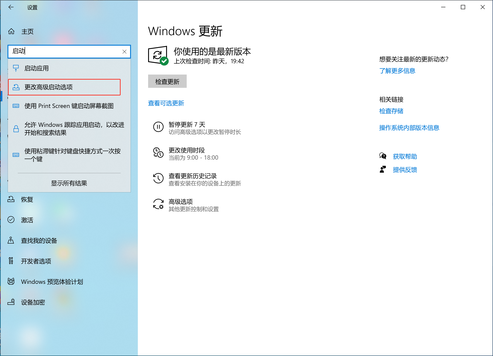
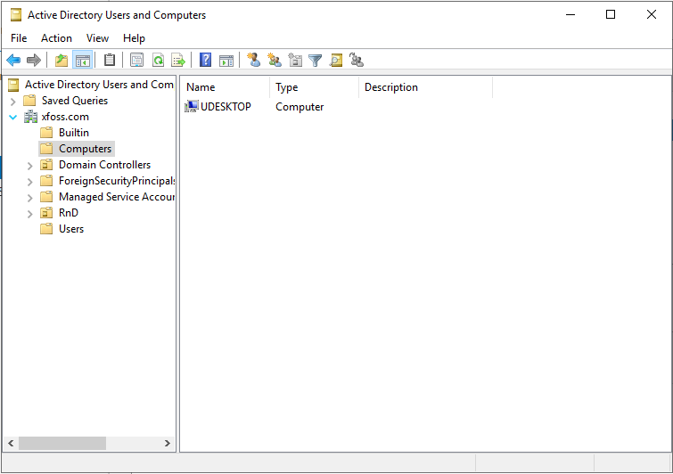
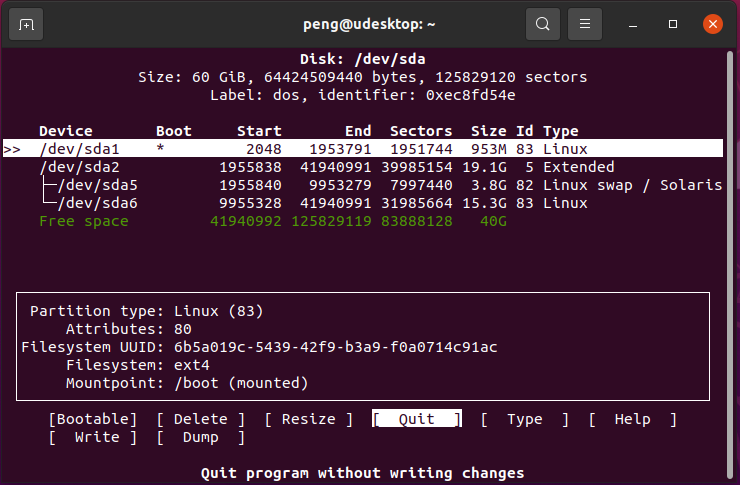

# Linux 系统管理

本文记录一些 Linux 系统管理相关笔记。


## `auditd` 部署的危险性


`auditd` 会使用到内核审计模块，极容易影响系统性能。__在配置不当的情况下，会直接导致系统挂起，以及启动失败__。千万不能在生产系统上部署 `auditd`。

参考：

- [linux audit审计系统](https://zhuanlan.zhihu.com/p/337289840)

- [第 7 章 系统审核](https://access.redhat.com/documentation/zh-cn/red_hat_enterprise_linux/7/html/security_guide/chap-system_auditing)


## `crontab` 定时任务运行问题


在复杂的定时任务中，`crontab` 因为不会发生用户登录动作，而导致用户 home 目录下的 `.bashrc` （或 `.zshrc`） 脚本文件不会运行，因此其中设置的环境变量就不会生效。在定时任务依赖这些环境变量时，那么这些定时任务就会失败。


此时，应 `source /etc/profile && source /etc/bashrc && source ~/.bashrc`，然后运行定时任务。


## `/etc/fstab` 中的挂载项导致 Linux 开机失败


在机房整理过程中（2024.9.8）一台 Linux 服务器启动失败，进入安全模式。经查这是由于 `/etc/fstab` 中一些加载项无法加载导致。关机后从 U 盘启动进入 Live Linux 系统。并参考 [挂载 LVM 逻辑卷](#挂载-lvm-逻辑卷)，挂载原系统上的 `/dev/mapper/rhel-root` 卷到 `/media/tmpRoot`，然后修改原系统的 `/etc/fstab`，重启成功启动该主机 Linux 系统。


## `/etc/rc.local` Linux 自启动程序


RH/CentOS EL7 上，可以在 `/etc/rc.local` 中，加入随系统启动的自启动程序。


```console
# ll /etc/rc.local
lrwxrwxrwx. 1 root root 13 Mar 29 00:14 /etc/rc.local -> rc.d/rc.local
```


> “但是自从 Debian 9 开始，Debian 默认不带 /etc/rc.local 文件，而 rc.local 服务却还是自带的”


因此，在 Debian 系统上如何加入自启动程序，请参阅下面的链接。


> **参考**
>
> - [Linux开机启动程序rc.local](https://www.cnblogs.com/wucongzhou/p/12588682.html)
>
> - [Debian 12 解决 /etc/rc.local 开机启动问题](https://u.sb/debian-rc-local/)


## CentOS `debuginfo-install` 问题


调试信息显示，需要安全 `glibc-2.17-317.el7.x86_64` 的包，就要前往 CentOS Debuginfo Mirror 下载下面两个包：

- `glibc-debuginfo-common-2.17-317.el7.x86_64.rpm`

- `glibc-debuginfo-2.17-317.el7.x86_64.rpm`


然后运行以下命令安装这两个软件包。


```console
rpm -ivh glibc-debuginfo-common-2.17-317.el7.x86_64.rpm glibc-debuginfo-2.17-317.el7.x86_64.rpm
```


> **参考**：
>
> - [gdb提示Missing separate debuginfos, use: debuginfo-install glibc-2.17-325.el7_9.x86_64...](https://blog.csdn.net/hope18578/article/details/122384730)
>
> - [CentOS Debuginfo Mirror](http://debuginfo.centos.org/7/x86_64/)


## RH/CentOS EL6.9/7.9 `/etc/hosts.allow` 问题


经实地配置测试，EL6.9/EL7.9 上，`/etc/hosts.allow` 的配置有差异。在 EL7.9 上，如下配置没有问题（可以达到预期效果，即放行指定网段，拒绝其他网段）。


- `/etc/hosts.deny`

```conf
sshd: ALL
```


- `/etc/hosts.allow`

```conf
sshd: localhost
sshd: 10.10.1.0/24
```


但在 EL6.9 上，这样写不能达到预期效果，会拒绝包括 `10.10.1.0/24` 在内的全部 SSH 连接。在 EL6.9 上应如下配置（`/etc/hosts.deny` 保持不变）。


- `/etc/hosts.deny`


```conf
sshd:localhost:allow
sshd:10.10.1.:alllow
```


**此外**，在失去对所配置主机的 SSH 访问后，可通过服务器频带外管理，out-of-band management 平台（DELL iDrac，DELL Remote Access Controller）登入系统修改此配置。若iDrac 不可用，则可通过 LSF `bsub -m xfoss-com-03 -Ip bash` 命令，将 `bash` 提交到目标机器 `xfoss-com-03` 上执行，从而获得对目标机器的访问，然后修改此配置并获取到对目标机器的 SSH 访问。


> **参考**：[Linux限制某些用户或IP登录SSH、允许特定IP登录SSH](https://blog.csdn.net/jined/article/details/123344777)


## `modprobe -a vmw_vmci vmmon` 问题


在 manjaro 上，安装了 vmware-workstation 后，运行 `vmware` 会报出 `vmmon` 找不到的问题。


而在运行 `sudo modprobe -a vmmon` 时，会报错错误：


```console
modprobe: WARNING: Module vmmon not found in directory /lib/modules/6.6.32-1-MANJARO
```

此时执行以下操作，即可解决此问题。


```console
$ uname -r
6.6.32-1-MANJARO
$ sudo pacman -S linux66-headers
$ sudo modprobe -a vmw_vmci vmmon
```


## 删除 3 个月（90 天前）的文件与文件夹


```bash
{{#include ../projects/delete_3_mo_ago.sh}}
```

其中 `-mtime +90` 表示 90 天前有改动的文件和文件夹。


## 调整 Linux LVM 分区大小


近期发现一台 Linux 服务器分区不合理， `/` 根分区过小（`50G`）, 其与 `/home` 分区（分配了较多空间，但是并未使用）一起在一个 LVM 逻辑卷（合计约 `1.7T`）下，使用了 `xfs` 文件系统。


调整他们大小的命令如下：


```console
umount -lf /home
lvremove /dev/mapper/centos-home
lvextend -L +1000G /dev/mapper/centos-root
xfs_growfs /dev/mapper/centos-root
lvcreate -L 400G -n home centos
mkfs.xfs /dev/centos/home
lsblk -f
lvdisplay
mkfs.xfs /dev/centos/home
mount /dev/centos/home /home
df -h
```


> 参考：[Chapitre 5. Modifying the size of a logical volume](https://access.redhat.com/documentation/fr-fr/red_hat_enterprise_linux/9/html/configuring_and_managing_logical_volumes/modifying-the-size-of-a-logical-volume_configuring-and-managing-logical-volumes#doc-wrapper)


## 列出 `wheel` 组下用户，及将用户从 `wheel` 组移除


列出 `wheel` 组下的用户


```console
getent group wheel
```


将用户从 `wheel` 组移除


```console
gpasswd --delete username wheel
```


## Debian 网络配置中的一个问题


在安装了 Debian 基本系统，手动配置了网络接口 IP 地址后，因需要使用其图形界面，故安装了 Xfce, Lxde 两个桌面环境，而随之安装了 [`connman` 软件包](https://packages.debian.org/bookworm/connman)。此时原先手动配置的 IP 地址失效，`connman` 接管了系统网络接口的配置，手动配置的 IP 地址失效，网络接口将默认通过 DHCP 获取 IP 地址，除非在 `connman` 中设置了 IP 地址。


此外，`connman` 将建立一条默认 `default` 路由，且经测试，该默认路由无法通过 `ip route delete` 或 `route delete` 删除。从而给主机通信造成问题。


要在使用 `connman` 的情况下，有正确的默认路由，可修改 `connman` 配置文件 `/etc/connman/main.conf`，利用 `NetworkInterfaceBlacklist`，先暂时把不希望作为默认路由的网卡，设置为不由 `connman` 管理，随后运行 `systemctl restart connman` 即可生效。等得到正确的默认路由后，再注释掉这个配置，此后也要运行 `systemctl restart connman`。


### Debian IP 地址设置


在一个安装的 Debian 机器上，想要配置静态 IP 地址，发现修改 `/etc/network/interfaces` 并不生效。后面发现，该机器上安装了 `xfce`、`lxde` 桌面环境，需要使用 `root` 账号，在图形下于 `NetworkManger Applet` 上点击鼠标右键，通过 `Edit connections` 进行添加。


此外，Debian 上的网络连接会因为某种原因（如 `apt purge -y connman`）DOWN 掉，这时需要在 `root` 用户下，运行 `ifup ens192` 类似命令开启，网络连接才又会正常。


## `sshd_config` 中 `UsePAM yes` 及 `PAM` 环境变量的问题


现 Ubuntu 22.04.1 已经成功加入 M$ AD，但是无法使用 AD 上的账号，进行 SSH 登录。排查后，发现需要开启 `sshd_config` 中，以下的项目：


- `PasswordAuthentication yes`

- `KbdInteractiveAuthentication yes`

- `UsePAM yes`

而在可以通过 AD 上的账号登录后，又报错以下错误：

```console
Last login: Sat Mar  2 16:43:18 2024                                                                                
-bash: groups: 未找到命令                                                                                           
命令 “lesspipe” 可在以下位置找到                                                                                    
 * /bin/lesspipe                                                                                                    
 * /usr/bin/lesspipe                                                                                                
由于 /usr/bin:/bin 不在 PATH 环境变量中，故无法找到该命令。                                                         
lesspipe：未找到命令                                                                                                
命令 “dircolors” 可在以下位置找到                                                                                   
 * /bin/dircolors
 * /usr/bin/dircolors                                                                                               
由于 /bin:/usr/bin 不在 PATH 环境变量中，故无法找到该命令。                                                         
dircolors：未找到命令
```

分析是 PAM 登录方式下，未能正确加载用户环境变量所致。故要修改 `/etc/security/pam_env.conf` 文件，取消以下两行的注释：


```conf
PATH            DEFAULT=${HOME}/bin:/usr/local/bin:/bin\
:/usr/bin:/usr/local/bin/X11:/usr/bin/X11
``` 

然后在使用 AD 账号登录系统后，不再报出上面有个环境变量的错误。


## 安装 `samba` 时 `yum` 依赖失败的处理（`glibc-common`）


参考：[ Yum Dependencies resolution fail (glibc-common)](https://www.linuxquestions.org/questions/linux-newbie-8/yum-dependencies-resolution-fail-glibc-common-4175582316/)


1. 检查重复


```console
sudo yum list --showduplicates glibc
```

2. 降级 `glibc`

```console
sudo yum downgrade glibc glibc-common glibc-devel glibc-headers
```


3. 安装 `samba`

```console
sudo yum -y install samba-common samba samba-client smbldap-tools openldap-clients nss-pam-ldapd
```


## 查看服务器型号、序列号与内存插槽、规格


- 查看服务器型号、序列号：`dmidecode -t1`

- 查看内存插槽情况：`dmidecode | grep -P -A5 "Memory\s+Device" | grep Size | grep -v Range`

- 查看内存规格：`dmidecode -t memory`


## GParted 分配未分配磁盘空间


参考：[How to allocate unallocated disk space with GParted Live?](https://askubuntu.com/a/856990)


- 先将扩展分区，the Extended partition，增长到磁盘末尾

- 随后即可在扩展分区下，将需要增大的分区增大到先前未分配的空间


## 挂载 LVM 逻辑卷


在 `/dev/sda3` 是个逻辑卷时，`mount /dev/sda3 /media/tmpRoot` 就会报错：


```console
mount: unknown filesystem type 'LVM2_member'
```

要挂载 LVM，就要先了解其内部结构，以及 LVM 的名字，此时需要使用 `fdisk -l` 命令：


其中可以看出，`/dev/sda` 有三个分区，其中 `/dev/sda3` 是个 Linux LVM，其名字为 `mapper`，他下面又有三个磁盘，分别是：


- `/dev/mapper/centos-root`

- `/dev/mapper/centos-swap`

- `/dev/mapper/centos-home`


了解这些信息后，即可使用 `mount /dev/mapper/centos-root /media/tmpRoot`，将 `/dev/mapper` 下的 `centos-root` 磁盘，挂载到 `/media/tmpRoot` 上了。前提是当前主机系统安装了 `lvm2` 支持（所幸使用的 Linux 启动盘 Clonezilla，对各种文件系统支持非常好）。


参考链接：

- [mount: unknown filesystem type 'LVM2_member'解决方案](https://www.cnblogs.com/dancesir/p/14200805.html)

- [挂载硬盘，提示 mount: unknown filesystem type 'LVM2_member'的解决方案](https://blog.csdn.net/colin_yu/article/details/77892918)


## Debian 中支持 `ll` 命令


在 `/etc/profile.d` 下，编写一个 `ll_cmd.sh` 脚本，内容如下：


```bash
alias ll='ls -alF'
```

`source /etc/profile.d/ll_cmd.sh` 会立即生效，以后重启系统后将自动生效。


## 在 WSL2 GUI 中使用 pulseaudio 播放声音


参考：[在 WSL2 GUI 中使用 pulseaudio 播放声音](https://blog.csdn.net/jiexijihe945/article/details/131680406)


## 使用 `chpasswd` 批量修改密码


首先以下面的格式，建立 `user-list.txt` 文件：


```txt
user1:password2
user2:password2
user3:password3
...
```

然后执行 `sudo chpasswd < user-list.txt` 即可批量修改密码。


## `NetworkManager.service` is masked

此问题在 `$ sudo systemctl enable --now NetworkManager.service` 时，会导致失败，报出如下错误：

```console
Failed to enable unit: Unit file /etc/systemd/system/NetworkManager.service is masked.
```

参考 [What is a masked service?](https://askubuntu.com/a/1017315)，可以解除该服务的遮蔽，从而解决问题。


## X2go 安装过程


快速将咱们的机器转入到一台 X2Go 服务器：


```bash

sudo apt-add-repository ppa:x2go/stable
sudo apt-get update
sudo apt-get install x2goserver x2goserver-xsession ubuntu-mate-core mate-tweak lxde xfce4 x2gomatebindings x2golxdebindings -y # if you use LXDE/lubuntu
```

快速安装 `x2goclient`:


```bash
sudo apt-add-repository ppa:x2go/stable
sudo apt-get update
sudo apt-get install x2goclient
```


### "Authentication required. System policy prevents WiFi scans"

在使用 X2go 客户端连接到 Linux Mate 桌面时，会遇到这个问题。参考：

- [How do I fix "System policy prevents Wi-Fi scans" error?](https://www.reddit.com/r/gnome/comments/py9ln0/how_do_i_fix_system_policy_prevents_wifi_scans/)

- [xRDP – Cannot connect to WiFi Networks in xRDP session – System policy prevents WiFi scans. How to Fix it !](https://c-nergy.be/blog/?p=16310)

在 `/etc/polkit-1/localauthority/50-local.d/` 下建立一个 `47-allow-wifi-scan.pkla` 策略文件，内容如下：

```plka
[Allow Wifi Scan]
Identity=unix-user:*
Action=org.freedesktop.NetworkManager.wifi.scan;org.freedesktop.NetworkManager.enable-disable-wifi;org.freedesktop.NetworkManager.settings.modify.own;org.freedesktop.NetworkManager.settings.modify.system;org.freedesktop.NetworkManager.network-control
ResultAny=yes
ResultInactive=yes
ResultActive=yes
```

然后运行 `$ sudo systemctl restart polkit.service` 重启该服务，之后问题解决。

### X2Go "Globally allow server-side disabling of the clipboard" 问题

此问题已在 `X2Go` `4.0.1.16` 版本中解决，参考 [Globally allow server-side disabling of the clipboard](https://bugs.x2go.org/cgi-bin/bugreport.cgi?bug=506)

在文件 `/etc/x2go/x2goagent.options` 中，找到 `X2GO_NXAGENT_DEFAULT_OPTIONS+=" -clipboard both"` 这行，将其解除注释，然后根据需要设置 `both`、`client`、`server` 或 `none` 选项。


### X2go "Authentication is required to create a color profile/managed device"  问题


参考：[How to fix “Authentication is required to create a color profile/managed device” on Ubuntu 22.04](https://www.geekdecoder.com/how-to-fix-authentication-is-required-to-create-a-color-profile-managed-device-on-ubuntu-22-04/)


解决方法（Debian Bookworm）：

```console
sudo mkdir -p /etc/polkit-1/localauthority/50-local.d
sudo vim /etc/polit-1/localauthority/50-local.d/45-allow-colord.pkla
```

将下面的内容，粘贴到该文件：


```pkla
[Allow Colord all Users]
Identity=unix-user:*
Action=org.freedesktop.color-manager.create-device;org.freedesktop.color-manager.create-profile;org.freedesktop.color-manager.delete-device;org.freedesktop.color-manager.delete-profile;org.freedesktop.color-manager.modify-device;org.freedesktop.color-manager.modify-profile
ResultAny=no
ResultInactive=no
ResultActive=yes
```


然后运行 `$ sudo systemctl restart polkit.service` 重启该服务，之后问题解决。


## "Ehternet device not managed" 问题

在安装 Ubuntu 时，因安装的是服务器版本，而只安装了 `ubuntu-mate-core mate-tweak lxde xfce4` 桌面，重启后发现没有网络连接。


## Ubuntu 安装 FirefoxESR

Mozilla Firefox 有着两个发布系列：**Rapid** 与 **ESR**。Rapid 发布

添加 Mozilla 官方 PPA：

```bash
sudo add-apt-repository -y ppa:mozillateam/ppa
```

安装 FirefoxESR:

```bash
sudo apt install -y firefox-esr
```

参考：[How to install Firefox ESR via PPA in Ubuntu 22.04 | 20.04](https://ubuntuhandbook.org/index.php/2022/03/install-firefox-esr-ubuntu)


## `dpkg-statoverride` 命令

在安装软件包时，偶然会遇到下面这种情况：


这是就要查看这个 `statoverride` 文件：

```bash
$ sudo dpkg-statoverride --list
geoclue geoclue 755 /var/lib/geoclue
root lp 775 /var/log/hp/tmp
root crontab 2755 /usr/bin/crontab
root ssl-cert 710 /etc/ssl/private
root x2gouser 2755 /usr/lib/x2go/libx2go-server-db-sqlite3-wrapper
```

这时运行以下命令：

```bash
sudo dpkg-statoverride --remove /usr/lib/x2go/libx2go-server-db-sqlite3-wrapper
```

删除 `x2gouser` 的那行，随后就解决了之前报出的问题，可以正常安装软件包了。

参考：[syntax error: unknown user 'munin' in statoverride file](https://serverfault.com/a/549001)


## Docker 下运行 NDS 交叉编译器报出错误


```console
./riscv32-elf-gcc --version
bash: ./riscv32-elf-gcc: cannot execute: required file not found
```

此时运行：

```console
$ ldd ./riscv32-elf-gcc
        /lib64/ld-linux-x86-64.so.2 (0x7f8651aec000)
        libm.so.6 => /lib64/ld-linux-x86-64.so.2 (0x7f8651aec000)
        libc.so.6 => /lib64/ld-linux-x86-64.so.2 (0x7f8651aec000)
Error loading shared library ld-linux-x86-64.so.2: No such file or directory (needed by ./riscv32-elf-gcc)
```

```console
LDD(1)                                                              Linux Programmer's Manual                                                             LDD(1)

NAME
       ldd - print shared object dependencies

SYNOPSIS
       ldd [option]... file...

DESCRIPTION
       ldd prints the shared objects (shared libraries) required by each program or shared object specified on the command line.  An example of its use and out‐
       put is the following:

         $ ldd /bin/ls
                 linux-vdso.so.1 (0x00007ffcc3563000)
                 libselinux.so.1 => /lib64/libselinux.so.1 (0x00007f87e5459000)
                 libcap.so.2 => /lib64/libcap.so.2 (0x00007f87e5254000)
                 libc.so.6 => /lib64/libc.so.6 (0x00007f87e4e92000)
                 libpcre.so.1 => /lib64/libpcre.so.1 (0x00007f87e4c22000)
                 libdl.so.2 => /lib64/libdl.so.2 (0x00007f87e4a1e000)
                 /lib64/ld-linux-x86-64.so.2 (0x00005574bf12e000)
                 libattr.so.1 => /lib64/libattr.so.1 (0x00007f87e4817000)
                 libpthread.so.0 => /lib64/libpthread.so.0 (0x00007f87e45fa000)
...
```


解决办法：安装 [`gcompat`](https://pkgs.alpinelinux.org/package/edge/community/x86_64/gcompat)。

```console
# apk add gcompat
```

参见：[Docker Alpine executable binary not found even if in PATH](https://stackoverflow.com/a/66974607)


## `tar` 命令用法


将多个文件压缩到一个压缩包（带通配符）：


```bash
tar czf ~/wise.tar.gz -T <(\ls wise*) System.map
```

此命令会把当前目录下以 `wise` 开头的所有文件，与 `System.map` 文件一起打包进 `wise.tar.gz` 这个压缩包。而解压缩的步骤如下：

```bash
mkdir wise-bin
tar xzf wise.tar.gz -C wise-bin
```

解压得到一下文件：


```bash
~/wise-bin$ ls
System.map  wise  wise-boot-ram.bin  wise.cfg  wise.cfg.configs  wise.lds  wise.map  wise.sym
```


## 切换 GRUB 默认启动项

参考：[How do I change the GRUB default boot?](https://unix.stackexchange.com/a/560444)

```bash
grep menuentry /boot/grub/grub.cfg # it will show all available menuentries
sudo vim /etc/default/grub # replace GRUB_DEFAULT=0 with GRUB_DEFAULT="needed menu entry from above"
sudo update-grub # update grub configuration file
```

> *注意*：运行 `update-grub` 时，在 Ubuntu 上会给出 `Advanced ....` 的提示信息，按照提示信息再编辑 `/etc/default/grub` 文件，即可消除该提示信息，且系统可以新设定的启动项启动。


## 安装 Linux 系统后追加安装 Windows 系统处理


- 使用 [GParted](https://gparted.org/) 启动盘，收缩 Linux 分区，给 Windows 安装腾出磁盘空间；

- 安装 Windows 系统到腾出的磁盘空间，随后原先的 [GRUB](https://www.gnu.org/software/grub/) 引导程序会被 Windows 的引导程序附带，从而系统暂时只能启动 Windows；

- 此时进入 Windows 系统，在设置中选择 “更改高级启动选项”，点击其中的 “高级启动” -> “立即重新启动”，即可进入原先的 Linux 系统；




- 进入 Linux 系统后，运行 `os-prober`、`update-grub` 等程序，重新建立 GRUB 引导程序，实现 Windows/Linux 双系统引导。


参考链接：[GRUB does not detect Windows](https://askubuntu.com/a/1322753)。


## 将Linux机器加入到AD


_本文以 Ubuntu 20.04为例，记录将 Linux 机器加入到 M$ AD的操作过程。_

### LDAP（AD）中的一些术语

- DN: Distinguished Name, 区分名
- CN：Common Name, 用户名/服务器名/计算机名
- OU: Organization Unit，组织单元，最多可以有4级，每级最长32个字符
- DC: Domain Component


### 00. 安装 SSSD 软件及工具

SSSD 是 **System Security Services Daemon** 的缩写。安装以下软件：

```bash
sudo apt install -y vim sssd-ad sssd-tools realmd adcli krb5-user
```

其中 `krb5-user` 是必须的，且需要修改 `/etc/krb5.conf` 文件，加入下面的配置：

```conf
[libdefaults]
    rdns = false
```

> **注**：对于 CentOS 7，需安装如下的这些软件包：

```console
sudo yum install sssd realmd oddjob oddjob-mkhomedir adcli samba-common samba-common-tools krb5-workstation openldap-clients policycoreutils-python -y
```

在 Debian Bookworm 上，需安装以下软件包：


```console
sudo apt -y install realmd sssd sssd-tools libnss-sss libpam-sss adcli samba-common-bin oddjob oddjob-mkhomedir packagekit
```

> 对于 Ubunt 22.04，还需检查 `/etc/krb5.conf`, 确保有着下面的配置（否则域用户登录不上）：


```conf
[realms]
        XFOSS.COM = {
                kdc = DC.XFOSS.COM
                admin_server = DC.XFOSS.COM
        }
```

### 01. 主机名及主机名的解析

编辑文件 `/etc/hostname`，将主机名修改为 FQDN 样式（比如 `udesktop.xfoss.com`）。

通过 `hostname -f` 查看。同时在 Windows 服务器上加入对应的 `A` 记录。

> 注：经测试，设置为仅主机名，而非 FQDN 也是可行的，比如 `sta-neo-fpga`。

### 02. 在 Linux 机器上配置有效的 DNS 服务器

安装 `resolvconf` 软件包，并启动 `resolvconf` 服务，修改 `/etc/resolvconf/resolvconf.d/head`配置文件（加入 `nameserver 192.168.153.131`, 其中 `192.168.153.131` 就是配置了 DNS 服务的 DC 服务器地址），然后运行 `sudo resolvconf -u` 更新配置。

```bash
sudo apt install resolvconf -y
sudo systemctl enable --now resolvconf.service
sudo vim /etc/resolvconf/resolv.conf.d/head
sudo resolvconf -u
```

> **注意**：在 CentOS 7 上没有 `resolvconf` 软件包，可修改 `/etc/resolv.conf`，然后使用命令 `$ sudo chattr +i /etc/resolv.conf` 将这个文件属性，设置为不可修改（immutable）。

### 03. 在 Linux 机器上配置时间服务

将配置了 NTP 服务的 DC 服务器，配置为 Linux 机器的 NTP 服务器。编辑文件：

```bash
sudo vim /etc/systemd/timesyncd.conf
```

修改为：

```conf
[Time]
NTP=dc.xfoss.com
FallbackNTP=ntp.ubuntu.com
```

### 04. 连接到 AD


**04-01. 发现 Active Directory**

运行命令（无需 `sudo`）：

```bash
realm discover xfoss.com
```

```bash
xfoss.com
  type: kerberos
  realm-name: XFOSS.COM
  domain-name: xfoss.com
  configured: no
  server-software: active-directory
  client-software: sssd
  required-package: sssd-tools
  required-package: sssd
  required-package: libnss-sss
  required-package: libpam-sss
  required-package: adcli
  required-package: samba-common-bin
```

在前面的配置都正确的情况下，就可以看这个有关即将加入的域的这些信息。注意这里的 `Configured: no`，只是告诉你尚未加入到这个域。

在加入到域之后，这个命令的输出如下所示：

```bash
xfoss.com
  type: kerberos
  realm-name: XFOSS.COM
  domain-name: xfoss.com
  configured: kerberos-member
  server-software: active-directory
  client-software: sssd
  required-package: sssd-tools
  required-package: sssd
  required-package: libnss-sss
  required-package: libpam-sss
  required-package: adcli
  required-package: samba-common-bin
  login-formats: %U@xfoss.com
  login-policy: allow-realm-logins
```


**04-02. 加入到活动目录**

要加入到活动目录，以 `sudo` 执行以下命令：

```bash
sudo realm join -U lenny.peng xfoss.com --os-name="`uname -o`" --os-version="`uname -rsv`" --install='/' --verbose
```

也可以使用 `Administrator` 账号，但测试不能使用 `lenny.peng@xfoss.com`这样的账号。其中 `lenny.peng` 有相应的 AD 管理权限。

这个命令将 Linux 机器加入到 AD 下的 `Computers` 之下，如下图所示:




> **注**：在 CentOS 7 下执行这个命令，会报错：

```console
$ sudo realm join -U lenny.peng xfoss.com --os-name="`uname -o`" --os-version="`uname -rsv`" --install='/' --verbose
 * Resolving: _ldap._tcp.xfoss.com
 * Performing LDAP DSE lookup on: 192.168.192.135
 * Successfully discovered: xfoss.com
Password for lenny.peng:
 * Assuming packages are installed
 * LANG=C /usr/bin/net -s /var/cache/realmd/realmd-smb-conf.XG63V1 -U lenny.peng ads join xfoss.com osName=GNU/Linux osVer=Linux 3.10.0-1160.80.1.el7.x86_64 #1 SMP Tue Nov 8 15:48:59 UTC 2022
 ! Failed to enroll machine in realm: Failed to execute child process “/usr/bin/net” (No such file or directory)
realm: Couldn't join realm: Failed to enroll machine in realm. See diagnostics.
```

> 解决方法：在 CentOS 7 上，执行 `$ sudo yum install samba-common-tools -y` 安装这个 `samba-common-tools` 软件包。
>
> **注意**：似乎还应安装 `dconf-editor` 这个软件包。

要脱离 AD，以 `sudo` 模式，运行 `sudo realm leave xfoss.com`。

此时以普通用户运行 `realm list xfoss.com`，输出与 `realm discover xfoss.com` 的输出一致。


**04-03. 配置自动创建用户主目录（Creating home directory automatically）**

运行命令 `sudo pam-auth-update --enable mkhomedir`, 就可以在用户登录后，自动创建用户主目录。


也可以编辑 PMA 配置文件 `/etc/pam.d/common-session`，加下面的内容添加到该文件末尾：


```conf
session optional        pam_mkhomedir.so skel=/etc/skel umask=077
```


> 创建出来的主目录的格式为： `/home/hailin.peng@xfoss.com`、`/home/lenny.peng@xfoss.com`

> **注意**：对于 CentOS 7，修改配置文件 `/etc/sssd/sssd.conf` 为：


```conf
[domain/xfoss.com]
use_fully_qualified_names = False
fallback_homedir = /home/%u
```

> 然后重启 `sssd`：`$ sudo systemctl restart sssd`。

（在 CentOS 7 上）用户登录的情况：

```console
ssh lenny.peng@192.168.192.134
lenny.peng@192.168.192.134's password:
Creating home directory for lenny.peng.
```

**04-04. 对设置进行测试**

> 可能需要需要重启系统，设置才能生效。

**测试发现，Linux下也是支持新用户首次登录修改密码的。在GUI登录下，直接修改密码后登录到桌面；但在SSH登录时，修改密码后会显示 `Connection to ulite.xfoss.com closed.` 之后需再次SSH登录。**


**04-05. 关于 `ldap-utils`**

`ldapsearch` 是 LDAP 实用工具之一。运行 `ldapsearch` 需要在域账号登录环境之下。否则会报错：

```bash
peng@uDesktop:~$ ldapsearch
SASL/GSSAPI authentication started
ldap_sasl_interactive_bind_s: Local error (-2)
        additional info: SASL(-1): generic failure: GSSAPI Error: Unspecified GSS failure.  Minor code may provide more information (No Kerberos credentials available (default cache: FILE:/tmp/krb5cc_1000))
```

此外，`ldapsearch` 的运行，还需要在 DNS 服务器上设置反向解析记录（Windows DNS 服务器设置十分简单）。

`ldapsearch` 命令的输出如下：

```bash
SASL/GSSAPI authentication started
SASL username: Lenny.Peng@XFOSS.COM
SASL SSF: 256
SASL data security layer installed.
...
```

一条典型的 LDAP 查询：

```bash
ldapsearch -x -h ldap://dc.xfoss.com -p 389 -D lenny.peng@xfoss.com -b "CN=Laxers Peng,ou=RnD,dc=xfoss,dc=com" "(objectClass=person)" -w "password"
```

经测试，此命令在 Linux 机器本地用户/域用户登录下，都可使用（通常`ldap-utils`实用工具，都需要域账户登录下，才能使用，因为这些工具，要查询`/tmp/krb5cc_xxx`登录凭据）。

其中 `-D` 后面是域管理用户，普通用户会报错： 

```bash
ldap_bind: Invalid credentials (49)
        additional info: 80090308: LdapErr: DSID-0C09041C, comment: AcceptSecurityContext error, data 52e, v4563
```

其中 `-x` 指定的是简单认证；`-b` 指`basedn`，搜索的 `base dn`；`(objectClass=person)`指的过滤条件；`-w` 直接输入管理员账号的密码（使用`-W`则在稍后提示输入密码）。

> 推测 `python-ldap` 库，是对 `ldap-utils` 的封装。


**04-06. 将 AD 中的用户，加入到 `sudoers` 组中**

修改配置文件：`/etc/sudoers.d/sudoers` 如下：

```conf
%sudoers    ALL=(ALL)       ALL
```

并在 AD 中建立一个用户组 `sudoers`，把需要 `sudo` 权限的用户，加入到这个组中，那么这些用户将在 Linux 系统中得到 `sudo` 权限。

### 05. 后记

经测试，在 M$ AD 域控制器服务器关机时，以前曾登录过 Linux 机器的用户，可以继续登录，未曾登录过的用户，无法登录。说明登录凭据被保存在了 Linux 机器本地。

在 Ubuntu 上，会出现照上述步骤配置好后，无法使用 LDAP/AD 账号登录的情况，如下所示：

```log
less /var/log/auth.log
...
Nov 30 14:19:15 fpga-sta sshd[7060]: pam_unix(sshd:auth): authentication failure; logname= uid=0 euid=0 tty=ssh ruser= rhost=10.12.10.96  user=leny.peng
Nov 30 14:19:15 fpga-sta sshd[7060]: pam_sss(sshd:auth): authentication success; logname= uid=0 euid=0 tty=ssh ruser= rhost=10.12.10.96 user=lenn.peng
Nov 30 14:19:15 fpga-sta sshd[7060]: pam_sss(sshd:account): Access denied for user lenny.peng: 4 (System error)
Nov 30 14:19:15 fpga-sta sshd[7060]: Failed password for lenny.peng from 10.12.10.96 port 52482 ssh2
Nov 30 14:19:15 fpga-sta sshd[7060]: fatal: Access denied for user lenny.peng by PAM account configuration [preauth]
...
```


一种妥协的处理办法是，将 `ad_gpo_access_control = permissive` 添加到 `/etc/sssd/sssd.conf` 配置文件的 `[domain/xfoss.com]` 小节，便可通过 LDAP/AD 登录了。

参考：[Debugging sssd login: pam_sss [...] System error](https://serverfault.com/q/872542)

**Debian 上不能正确显示组名字**


需要执行以下操作：


```console
 root@dlp:~# vi /etc/sssd/sssd.conf
# line 17 : change

# ldap_id_mapping = False
# add to the end

ldap_user_uid_number = uidNumber
ldap_user_gid_number = gidNumber
# clear cache and restart sssd

root@dlp:~# rm -f /var/lib/sss/db/*

root@dlp:~# systemctl restart sssd
```


## modprobe

> 随着 UEFI BIOS 的广泛使用，操作系统内核模块的加载，在BIOS 中开启了 “Secure Boot”选项后，就更加严格了。没有数字签名/内核认证的模块，是无法加载的。会出现没有权限报错，通过 “dmesg” 可以看到更多信息。

近期由于旧笔记本不支持5gHz WiFi网络，故采购一个USB的双频无线网卡（`Bus 003 Device 003: ID 0bda:c811 Realtek Semiconductor Corp. 802.11ac NIC`），这个无线网卡没有内核支持。需编译安装`dkms`的内核模块。驱动在 [这里](https://github.com/brektrou/rtl8821CU.git)。

参考项目的 `README.md` 文件即可安装上，且支持热插拔。

但是笔记本内置的 PCI 无线网卡就显得多余了。此时可将原来的`ath9k`内核驱动模块加以屏蔽。

`sudo vim.gtk3 /etc/modprobe.d/blacklist.conf`

将 

`blacklist ath9k` 

加入到该文件中，并运行

`sudo update-initramfs -u`


`sudo modprobe -r ath9k`

就可以去掉原有的 `ath9k` 无线网卡，只保留一个新的 USB 双频无线网卡。


## Linux下利用未分配的磁盘空间来扩充磁盘分区

Linux系统磁盘分区不够用时，可通过利用未分配的磁盘空间，来扩充相应磁盘分区。操作步骤如下。

### 00. 使用 `cfdisk` 查看磁盘情况

```bash
$sudo cfdisk
```



### 01. 修改分区表


### 使用 GParted 发行版

此方法更为简便，直接使用 GParted 启动镜像，可扩大 Linux 与 Windows 的分区，使用新增/闲置的磁盘空间。


## `cannot find required auxiliary files: ltmain.sh compile missing install-sh`


参考：[Automake error './ltmain.sh' not found](https://stackoverflow.com/a/22625555)

需要使用 `autoreconf` 工具，先要安装 `sudo apt install -y libtool`，然后运行 `autoreconf -i` 即可解决。


## `make uninstall`


在编译安装 GCC 时，由于没有配置 `--prefix=/opt/gcc-11.4.0`，而导致 `gcc` 被安装在 `/usr/local/bin` 下。此时欲运行 `make uninstall` 移除这种安装，但在 `gcc-11.4.0` 源码目录下，直接运行 `sudo make uninstall` 不行。查询发现，应在 `gcc-11.4.0/gcc` 目录下，才能执行 `sudo make uninstall` 命令。


参考：[卸载源码安装的gdb报错问题](https://axss.oschina.io/2018/12/21/%E6%8A%80%E6%9C%AF/2018-12-21-%E5%8D%B8%E8%BD%BD%E6%BA%90%E7%A0%81%E5%AE%89%E8%A3%85%E7%9A%84gdb%E6%8A%A5%E9%94%99%E9%97%AE%E9%A2%98/index.html)


## Debian（bookworm）网络接口 Bonding


今天（2024-4-22），在将存储中心接入万兆交换机时，要使用两条 40GE 链路端口聚合 bonding，以获取较高速率和可靠性。以下是配置记录。


Linux 主机 `/etc/network/interfaces`:


```console
auto ens1f0
iface ens1f0 inet manual
    bond-master bond0
    bond-mode 802.3ad

auto ens1f1
iface ens1f1 inet manual
    bond-master bond0
    bond-mode 802.3ad

auto bond0
iface bond0 inet static
    address 10.11.1.25
    netmask 255.255.255.0
    network 10.11.1.0
    bond-slaves ens1f0 ens1f1
    bond-mode 802.3ad
    bond-miimon 100
    bond-downdelay 200
    bond-updelay 200
    bond-lacp-rate 1
    bond-xmit-hash-policy layer2+3
```


交换机上的配置：


```console
interface eth-trunk 11
    description To-backup-center
    port link-mode access
    port default vlan 11
    max active-linknumber 2
interface 40GE 0/0/1
    eth-trunk 11
interface 40GE 0/0/2
    eth-trunk 11
   
```


### `ifup bond0` 失败问题解决


```console
root@backup:~# ifup bond0                                                                                                                              
/etc/network/if-pre-up.d/ifenslave: 39: echo: echo: I/O error
/etc/network/if-pre-up.d/ifenslave: 39: echo: echo: I/O error
RTNETLINK answers: File exists
ifup: failed to bring up bond0
```


此时需要运行 `ip add flush dev bond0`，刷新 `bond0` 的 IP 地址。随后运行 `ifup --force --verbose bond0` 可成功将 `bond0` 开启。与此类似 `ifdown --force --verbose bond0` 也可以将 `bond0` 关闭，并以 `verbose` 模式打印出其间的调试信息。 
