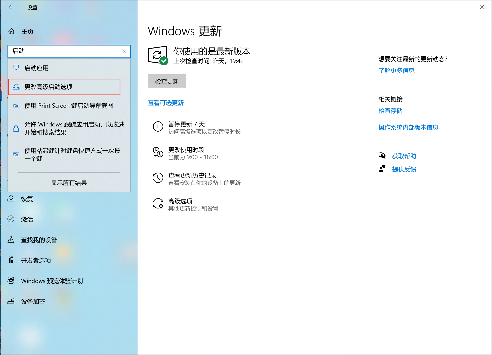

# Linux 系统管理

本文记录一些 Linux 系统管理相关笔记。


## `auditd` 部署的危险性


`auditd` 会使用到内核审计模块，极容易影响系统性能。__在配置不当的情况下，会直接导致系统挂起，以及启动失败__。千万不能在生产系统上部署 `auditd`。

参考：

- [linux audit审计系统](https://zhuanlan.zhihu.com/p/337289840)

- [第 7 章 系统审核](https://access.redhat.com/documentation/zh-cn/red_hat_enterprise_linux/7/html/security_guide/chap-system_auditing)


## Debian 中支持 `ll` 命令


在 `/etc/profile.d` 下，编写一个 `ll_cmd.sh` 脚本，内容如下：


```bash
alias ll='ls -alF'
```

`source /etc/profile.d/ll_cmd.sh` 会立即生效，以后重启系统后将自动生效。


## 在 WSL2 GUI 中使用 pulseaudio 播放声音


参考：[在 WSL2 GUI 中使用 pulseaudio 播放声音](https://blog.csdn.net/jiexijihe945/article/details/131680406)


## 使用 `chpasswd` 批量修改密码


首先以下面的格式，建立 `user-list.txt` 文件：


```txt
user1:password2
user2:password2
user3:password3
...
```

然后执行 `sudo chpasswd < user-list.txt` 即可批量修改密码。


## `NetworkManager.service` is masked

此问题在 `$ sudo systemctl enable --now NetworkManager.service` 时，会导致失败，报出如下错误：

```console
Failed to enable unit: Unit file /etc/systemd/system/NetworkManager.service is masked.
```

参考 [What is a masked service?](https://askubuntu.com/a/1017315)，可以解除该服务的遮蔽，从而解决问题。


## X2go 安装过程


快速将咱们的机器转入到一台 X2Go 服务器：


```bash

sudo apt-add-repository ppa:x2go/stable
sudo apt-get update
sudo apt-get install x2goserver x2goserver-xsession ubuntu-mate-core mate-tweak lxde xfce4 x2gomatebindings x2golxdebindings -y # if you use LXDE/lubuntu
```

快速安装 `x2goclient`:


```bash
sudo apt-add-repository ppa:x2go/stable
sudo apt-get update
sudo apt-get install x2goclient
```


## "Authentication required. System policy prevents WiFi scans"

在使用 X2go 客户端连接到 Linux Mate 桌面时，会遇到这个问题。参考：

- [How do I fix "System policy prevents Wi-Fi scans" error?](https://www.reddit.com/r/gnome/comments/py9ln0/how_do_i_fix_system_policy_prevents_wifi_scans/)

- [xRDP – Cannot connect to WiFi Networks in xRDP session – System policy prevents WiFi scans. How to Fix it !](https://c-nergy.be/blog/?p=16310)

在 `/etc/polkit-1/localauthority/50-local.d/` 下建立一个 `47-allow-wifi-scan.pkla` 策略文件，内容如下：

```plka
[Allow Wifi Scan]
Identity=unix-user:*
Action=org.freedesktop.NetworkManager.wifi.scan;org.freedesktop.NetworkManager.enable-disable-wifi;org.freedesktop.NetworkManager.settings.modify.own;org.freedesktop.NetworkManager.settings.modify.system;org.freedesktop.NetworkManager.network-control
ResultAny=yes
ResultInactive=yes
ResultActive=yes
```

然后运行 `$ sudo systemctl restart polkit.service` 重启该服务，之后问题解决。

## X2Go "Globally allow server-side disabling of the clipboard" 问题

此问题已在 `X2Go` `4.0.1.16` 版本中解决，参考 [Globally allow server-side disabling of the clipboard](https://bugs.x2go.org/cgi-bin/bugreport.cgi?bug=506)

在文件 `/etc/x2go/x2goagent.options` 中，找到 `X2GO_NXAGENT_DEFAULT_OPTIONS+=" -clipboard both"` 这行，将其解除注释，然后根据需要设置 `both`、`client`、`server` 或 `none` 选项。


## "Ehternet device not managed" 问题

在安装 Ubuntu 时，因安装的是服务器版本，而只安装了 `ubuntu-mate-core mate-tweak lxde xfce4` 桌面，重启后发现没有网络连接。


## Ubuntu 安装 FirefoxESR

Mozilla Firefox 有着两个发布系列：**Rapid** 与 **ESR**。Rapid 发布

添加 Mozilla 官方 PPA：

```bash
sudo add-apt-repository -y ppa:mozillateam/ppa
```

安装 FirefoxESR:

```bash
sudo apt install -y firefox-esr
```

参考：[How to install Firefox ESR via PPA in Ubuntu 22.04 | 20.04](https://ubuntuhandbook.org/index.php/2022/03/install-firefox-esr-ubuntu)


## `dpkg-statoverride` 命令

在安装软件包时，偶然会遇到下面这种情况：


这是就要查看这个 `statoverride` 文件：

```bash
$ sudo dpkg-statoverride --list
geoclue geoclue 755 /var/lib/geoclue
root lp 775 /var/log/hp/tmp
root crontab 2755 /usr/bin/crontab
root ssl-cert 710 /etc/ssl/private
root x2gouser 2755 /usr/lib/x2go/libx2go-server-db-sqlite3-wrapper
```

这时运行以下命令：

```bash
sudo dpkg-statoverride --remove /usr/lib/x2go/libx2go-server-db-sqlite3-wrapper
```

删除 `x2gouser` 的那行，随后就解决了之前报出的问题，可以正常安装软件包了。

参考：[syntax error: unknown user 'munin' in statoverride file](https://serverfault.com/a/549001)


## Docker 下运行 NDS 交叉编译器报出错误


```console
./riscv32-elf-gcc --version
bash: ./riscv32-elf-gcc: cannot execute: required file not found
```

此时运行：

```console
$ ldd ./riscv32-elf-gcc
        /lib64/ld-linux-x86-64.so.2 (0x7f8651aec000)
        libm.so.6 => /lib64/ld-linux-x86-64.so.2 (0x7f8651aec000)
        libc.so.6 => /lib64/ld-linux-x86-64.so.2 (0x7f8651aec000)
Error loading shared library ld-linux-x86-64.so.2: No such file or directory (needed by ./riscv32-elf-gcc)
```

```console
LDD(1)                                                              Linux Programmer's Manual                                                             LDD(1)

NAME
       ldd - print shared object dependencies

SYNOPSIS
       ldd [option]... file...

DESCRIPTION
       ldd prints the shared objects (shared libraries) required by each program or shared object specified on the command line.  An example of its use and out‐
       put is the following:

         $ ldd /bin/ls
                 linux-vdso.so.1 (0x00007ffcc3563000)
                 libselinux.so.1 => /lib64/libselinux.so.1 (0x00007f87e5459000)
                 libcap.so.2 => /lib64/libcap.so.2 (0x00007f87e5254000)
                 libc.so.6 => /lib64/libc.so.6 (0x00007f87e4e92000)
                 libpcre.so.1 => /lib64/libpcre.so.1 (0x00007f87e4c22000)
                 libdl.so.2 => /lib64/libdl.so.2 (0x00007f87e4a1e000)
                 /lib64/ld-linux-x86-64.so.2 (0x00005574bf12e000)
                 libattr.so.1 => /lib64/libattr.so.1 (0x00007f87e4817000)
                 libpthread.so.0 => /lib64/libpthread.so.0 (0x00007f87e45fa000)
...
```


解决办法：安装 [`gcompat`](https://pkgs.alpinelinux.org/package/edge/community/x86_64/gcompat)。

```console
# apk add gcompat
```

参见：[Docker Alpine executable binary not found even if in PATH](https://stackoverflow.com/a/66974607)


## `tar` 命令用法


将多个文件压缩到一个压缩包（带通配符）：


```bash
tar czf ~/wise.tar.gz -T <(\ls wise*) System.map
```

此命令会把当前目录下以 `wise` 开头的所有文件，与 `System.map` 文件一起打包进 `wise.tar.gz` 这个压缩包。而解压缩的步骤如下：

```bash
mkdir wise-bin
tar xzf wise.tar.gz -C wise-bin
```

解压得到一下文件：


```bash
~/wise-bin$ ls
System.map  wise  wise-boot-ram.bin  wise.cfg  wise.cfg.configs  wise.lds  wise.map  wise.sym
```


## 切换 GRUB 默认启动项

参考：[How do I change the GRUB default boot?](https://unix.stackexchange.com/a/560444)

```bash
grep menuentry /boot/grub/grub.cfg # it will show all available menuentries
sudo vim /etc/default/grub # replace GRUB_DEFAULT=0 with GRUB_DEFAULT="needed menu entry from above"
sudo update-grub # update grub configuration file
```

> *注意*：运行 `update-grub` 时，在 Ubuntu 上会给出 `Advanced ....` 的提示信息，按照提示信息再编辑 `/etc/default/grub` 文件，即可消除该提示信息，且系统可以新设定的启动项启动。


## 安装 Linux 系统后追加安装 Windows 系统处理


- 使用 [GParted](https://gparted.org/) 启动盘，收缩 Linux 分区，给 Windows 安装腾出磁盘空间；

- 安装 Windows 系统到腾出的磁盘空间，随后原先的 [GRUB](https://www.gnu.org/software/grub/) 引导程序会被 Windows 的引导程序附带，从而系统暂时只能启动 Windows；

- 此时进入 Windows 系统，在设置中选择 “更改高级启动选项”，点击其中的 “高级启动” -> “立即重新启动”，即可进入原先的 Linux 系统；




- 进入 Linux 系统后，运行 `os-prober`、`update-grub` 等程序，重新建立 GRUB 引导程序，实现 Windows/Linux 双系统引导。


参考链接：[GRUB does not detect Windows](https://askubuntu.com/a/1322753)。
