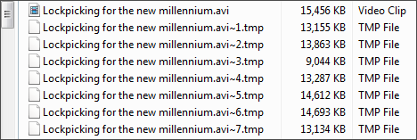

# 多线程与分段的 FTP

**Multi-threaded and Segmented FTP**

参考：[Multi-threaded and Segmented FTP ](https://whatbox.ca/wiki/Multi-threaded_and_Segmented_FTP)

## 并发的传输

**Concurrent transfers**

同时下载许多文件往往可以提高 FTP 速度，因为每个文件都要求建立自己的连接。

例如，如果没有分段的 FTP，咱们可以 100KB/s 的速度下载一个文件，但咱们的网络连接应该能够达到 1000KB/s 的速度。如果咱们同时下载 10 个文件，每个文件应能达到其 100 KB/s 的峰值，从而使总下载速度达到 1000 KB/s。

注意：这种方法只适用于同时传输许多文件。如果咱们想在下载单个文件时提高速度，请阅读下一节关于分段下载的内容。

## 分段的下载

**Segmented Downloading**

如果咱们从插槽中下载时速度不佳，咱们就可能想要尝试 "分段下载"。

从本质上讲，他所做的是将单个文件分解成许多小块。比方说，当咱们通过 FTP 从咱们的插槽下载单个文件时，咱们只能得到 100KB/s，但咱们应该能够达到 1MB/s 的速度。如果咱们能把这个单一的文件分成十块，每块都要求建立自己的连接，那么理论上咱们可以达到十倍的速度。

支持分段下载的 FTP 客户端不多，但下面提到了几个可以分段下载的客户端。

- Windows: [Cyberduck](https://cyberduck.io/), [CuteFTP Pro](https://www.globalscape.com/cuteftp) （只支持 FTP）, [SmartFTP Pro](https://www.smartftp.com/), [iGetter](https://www.igetter.net/downloads.html), [通过 Cygwin 运行的 lftp](https://whatbox.ca/wiki/lftp)
- macOS: [Cyberduck](https://cyberduck.io/), [Progressive Downloader](https://www.macpsd.net/), [Captain FTP](https://www.captainftp.com/), [iGetter](https://www.igetter.net/downloads.html), [lftp](https://whatbox.ca/wiki/lftp) （通过 [Homebrew](https://brew.sh/) 或 [MacPorts](https://www.macports.org/) 运行）
- Linux: [lftp](https://whatbox.ca/wiki/lftp)

## 客户端设置

- Windows: [Cyberduck](https://docs.cyberduck.io/cyberduck/download/?highlight=segmented), [CuteFTP Pro](https://whatbox.ca/wiki/CuteFTP_Pro#segmented_downloading) (只支持 FTP), [SmartFTP Pro](https://whatbox.ca/wiki/SmartFTP#segmented_downloading), [通过 Cygwin 运行的 lftp](https://whatbox.ca/wiki/lftp)
- macOS: [Cyberduck](https://docs.cyberduck.io/cyberduck/download/?highlight=segmented), [Captain FTP](https://whatbox.ca/wiki/Captain_FTP#segmented_downloading)
- Linux: [lftp](https://whatbox.ca/wiki/lftp#segmented_downloading)

## 多线程与分段比较

一个常见的误解是，多线程 == 分段下载。事实并非如此。GoFTP 是一个声称支持多线程的客户端，但实际上并不提供分段。分段允许 FTP 客户端将一个大文件分割成多个部分，并使用多个传输来同时下载这些部分（即独立的分段式并行 FTP 连接）。这些部分在完成后被重新组合成一个文件。

在活动的下载过程中，咱们会注意到同一文件的多个（临时）部分：

