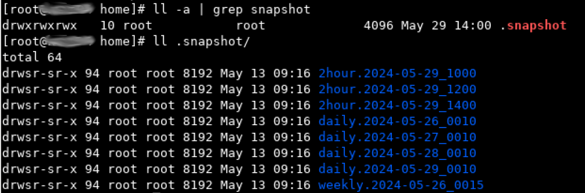

# 服务器管理


本文记录服务器管理方面的一些经验。


## 禅道 ZenTao 系统启动笔记


要启动禅道系统，首先要挂载用于备份的 `/backup`，然后进入 `/opt/zbox`，运行 `./zbox start`，如下所示：


```console
# mount 10.11.0.21:/0.135 /backup
# cd /opt/zbox
# ./zbox start
```


## DELL HTML5 虚拟控制台


iDRAC 7 或更新的版本，就有了 HTML5 的虚拟控制台，在选择该选项时，咱们就无需 Java 环境。


而对于 Java 下所下载的 `viewer.jnlp` 文件，则需要使用 [IcedTea-Web](https://adoptopenjdk.net/icedtea-web.html) 打开运行，并需要进一步的设置，比较麻烦。


> **参考**：[iDRAC Remote Console access or otherwise opening a .jnlp in a browser](https://forum.manjaro.org/t/idrac-remote-console-access-or-otherwise-opening-a-jnlp-in-a-browser/68467)


## 执行 `df -h` 命令卡住问题


近日，在连接了 DELL ME5012+ME412 存储，又挂载了很多 NFS 分区的一台 Debian Bookworm 主机上，执行 `df -h` 时出现卡顿。原先怀疑跟 ME5012 上的 SCSI 有关系，但最终发现是所挂载的一个 NFS 分区不可用造成。遂通过 `# umount -l /0.137-svn` 将该有问题的 NFS 挂载加以卸载，后问题解决 `df -h` 命令不再挂起。


> **参考**：[当df命令hang住了， 怎么办？](https://www.cnblogs.com/awpatp/p/13919924.html)


## 恢复 `rm -rf` 删除的数据


出现此类事故后，应立即关机。使用 GParted LiveCD 启动系统，`sudo su -` 后运行 `fdisk -l`，找到要恢复的磁盘设备。然后给 GParted 配置 IP 地址和 DNS 服务器。运行 `apt install -y extundelete` 安装 `extundelete`。然后直接运行 `extundelete /dev/mapper/vg_vol01-home –restore-all`，恢复 `home` 卷下的数据（应先 `cd` 到挂载的 NFS 目录）。


参考：

- [干货：“ rm -rf” 克星ext4magic](https://www.modb.pro/db/25652)

- [linux rm -rf * 文件恢复记](https://www.cnblogs.com/fps2tao/p/8676463.html)

- [Image backup with deleted files [duplicate]](https://unix.stackexchange.com/a/285999)


### 专业存储（NetApp）上的做法


对于专业存储，都会设置合理的快照计划，比如保留 3 个每两小时快照、4 个每天快照以及 1 个每周快照。在做了这样的快照设置时，挂载了数据卷的客户机上，可以通过 `cd .snapshot` 命令，访问到所挂载卷的这些快照，从而在用户有恢复误删除数据需求时，可以在对应的快照下，非常容易的恢复出他们想要的数据。


比如下面的 `/home` 是挂载的某台 NetApp 存储上， `/nishome` 卷的 `home` 目录（卷下的 Qtree 项目）。则其快照 `.snapshot` 如下图所示。





## H330 阵列卡 HBA 直通模式与 RAID 模式切换


HBA 模式须在 iDrac 中切换，在 UEFI 界面不会生效。

## 启动 iDrac 虚拟控制台


启动虚拟控制台有 Java 和 HTML5 两种方式。其中 Java 方式会下载一个 `.jnlp` 文件，需要 JRE 环境，且在运行这个 `.jnlp` 文件时，会出现签名问题而无法启动。因此需要选择 HTML5 方式启动虚拟控制台。

需要注意的是，iDrac 所使用网口 NIC 选项中，有 `Dedicated/LOM1/LOM2/LOM3/LOM4`，应选择的是 `Dedicated`。


## DELL 存储开机关机顺序

  
- 开机：打开 “扩展柜” 电源 -> 等待 5 分钟后，打开 “控制器” 电源 -> 等待 5 分钟后，打开 “服务器” 电源

- 关机：“服务器” 关机 -> 等待 5 分钟后，“控制器（通过 Storage Manager 执行关机）” -> 等待 5 分钟后，关闭 “扩展柜” 电源


## DELL ME5 多路径配置


在 Debian 12(Bookworm) 下，配置对 DELL ME5 的多路径（multipath）会很快。包含以下步骤。


- 安装 `multipath-tools` 软件包；

- 重启机器。然后运行 `multipath -l` 或 `multipath -v3`，根据 DM 多路径下的配置，列出 Dell PowerVault ME5 系列存储设备。


```console
...
===== paths list =====
uuid                              hcil    dev dev_t pri dm_st chk_st vend/prod/rev        dev_st
362cea7f05d1d84002d953761a24b9173 0:2:0:0 sdb 8:16  1   undef undef  DELL,PERC H740P Mini unknown
3600c0ff00065bf8774a1056601000000 1:0:0:0 sda 8:0   10  undef undef  DellEMC,ME5          unknown
3600c0ff00065bf8774a1056601000000 1:0:1:0 sdc 8:32  50  undef undef  DellEMC,ME5          unknown
```

注意其中的 `3600c0ff00065bf8774a1056601000000`，其中两个路径的 uuid 是一致的。


- 修改配置文件 `/etc/multipath.conf`，该文件是 `multipathd` 服务的配置文件；

```console
root@backup:~# cat /etc/multipath.conf
defaults {                                                                                                               find_multipaths yes
        user_friendly_names yes
}

blacklist {
}

devices {
        device {
                vendor "DellEMC"
                product "ME5"
                path_grouping_policy "group_by_prio"
                path_checker "tur"
                hardware_handler "1 alua"
                prio "alua"
                failback immediate
                rr_weight "uniform"
                path_selector "service-time 0"
        }
}
multipaths {
        multipath {
                wwid "3600c0ff00065bf8774a1056601000000"
                alias me5_vol01_20t
        }
}
```

- 重启服务：`systemctl restart multipathd`；随后运行 `fdisk -l`，有以下输出。


```console
root@backup:~# fdisk -l
Disk /dev/sdc: 18.19 TiB, 19999997558784 bytes, 39062495232 sectors
Disk model: ME5
Units: sectors of 1 * 512 = 512 bytes
Sector size (logical/physical): 512 bytes / 4096 bytes
I/O size (minimum/optimal): 4096 bytes / 1048576 bytes


Disk /dev/sda: 18.19 TiB, 19999997558784 bytes, 39062495232 sectors
Disk model: ME5
Units: sectors of 1 * 512 = 512 bytes
Sector size (logical/physical): 512 bytes / 4096 bytes
I/O size (minimum/optimal): 4096 bytes / 1048576 bytes


Disk /dev/sdb: 7.28 TiB, 7999376588800 bytes, 15623782400 sectors
Disk model: PERC H740P Mini
Units: sectors of 1 * 512 = 512 bytes
Sector size (logical/physical): 512 bytes / 512 bytes
I/O size (minimum/optimal): 262144 bytes / 1048576 bytes
Disklabel type: gpt
Disk identifier: BF366EEC-4128-4E6B-80D2-7EDC93E00A4B

Device        Start         End     Sectors  Size Type
/dev/sdb1      2048      999423      997376  487M Linux filesystem
/dev/sdb2    999424     1499135      499712  244M EFI System
/dev/sdb3   1499136    17123327    15624192  7.5G Linux swap
/dev/sdb4  17123328 15623780351 15606657024  7.3T Linux filesystem


Disk /dev/mapper/me5_vol01_20t: 18.19 TiB, 19999997558784 bytes, 39062495232 sectors
Units: sectors of 1 * 512 = 512 bytes
Sector size (logical/physical): 512 bytes / 4096 bytes
I/O size (minimum/optimal): 4096 bytes / 1048576 bytes
```

- 可以看到 `Disk /dev/mapper/me5_vol01_20t: 18.19 TiB, 19999997558784 bytes, 39062495232 sectors` 已经出现，随后即可使用磁盘工具对其格式化并加以使用。


### Debian 下格式化多路径的块设备


经由 `multipathd` 建立的多路径下的块设备，比如 `/dev/mapper/me5_vol01_20ti`，在使用命令 `sudo gparted /dev/mapper/me5_vol01_20ti`，欲对其进行分区格式化创建文件系统以加以利用时，发现总是会报出 `Device or resource busy` 错误。

有人的解决办法，是暂时移除多路径设备的映射。步骤如下：


- 移除多路径设备名字。（`multipath -f /dev/mappper/me5_vol01_20ti`）;

- 对多路径从设备运行 `gparted`。（如：`sudo gparted /dev/sdb`）;

- 重建多路径设备映射。（`multipath -r`）。


**注意**：在移除多路径设备时，若多路径设备已被挂载，那么会报出以下错误：


```console
root@backup:~# multipath -f /dev/mapper/me5_vol01_20t
59172.163246 | me5_vol01_20t-part1: map in use
```

在排除了对该多路径设备的已有挂载后，移除多路径设备的命令将不再报错。


参考：

- [mke2fs says "Device or resource busy while setting up superblock"](https://serverfault.com/a/727244/994825)

- [Multipath: Best and Safe Solution Map in Use Devices](https://www.teimouri.net/remove-multipath-device/)


## 存储上新加卷后 Linux 主机上找不到的问题


近日我在 DELL/EMC ME5012 上，从存储池创建出一个新卷后，无法在 Linux 主机上，通过 `fdisk -l` 找到。随后联系 DELL 技术支持工程师，按照他们所提供的资料，运行命令 `# /usr/bin/rescan-scsi-bus.sh -a` 后，成功发现这一存储上的新加卷。


```console
Disk /dev/sdg: 3.18 TiB, 3499999887360 bytes, 6835937280 sectors
Disk model: ME5
Units: sectors of 1 * 512 = 512 bytes
Sector size (logical/physical): 512 bytes / 4096 bytes
I/O size (minimum/optimal): 4096 bytes / 1048576 bytes


Disk /dev/sdh: 3.18 TiB, 3499999887360 bytes, 6835937280 sectors
Disk model: ME5
Units: sectors of 1 * 512 = 512 bytes
Sector size (logical/physical): 512 bytes / 4096 bytes
I/O size (minimum/optimal): 4096 bytes / 1048576 bytes


Disk /dev/mapper/mpathb: 3.18 TiB, 3499999887360 bytes, 6835937280 sectors
Units: sectors of 1 * 512 = 512 bytes
Sector size (logical/physical): 512 bytes / 4096 bytes
I/O size (minimum/optimal): 4096 bytes / 1048576 bytes
```


该脚本来自 [`sg3-utils`](https://sg.danny.cz/sg/sg3_utils.html) 软件包，Debian Linux 自带了这个软件包（[软件包：sg3-utils](https://packages.debian.org/bookworm/sg3-utils)）。


> 大多数操作系统都有 SCSI 直通接口，SCSI pass-through interfaces, 可让用户空间程序，user space programs，向设备发送 SCSI 命令并获取响应。通过 SCSI 到 ATA 转换，SCSI to ATA Translation, SAT，许多 ATA 磁盘现在都能处理 SCSI 命令。通常情况下，这个软件包中的每个实用程序，都能实现一条 SCSI 命令。有关 SCSI 命令和 SAT 的定义，请参见 [www.t10.org](https://www.t13.org/) 上的标准草案。ATA 命令定义在 [www.t13.org](https://www.t13.org/) 的标准草案中。有关本软件包中支持的 SCSI 和 ATA 命令与实用程序名称之间的映射，请参阅 [`COVERAGE`](https://github.com/hreinecke/sg3_utils/blob/master/COVERAGE) 文件。


## `btrfs` 分区的挂载


临时挂载 `btrfs` 分区，直接运行命令 `sudo mount /dev/mapper/me5_vol01_20ti-part1 /0.135`，即可把 `/dev/mapper/me5_vol01_20ti-part1` 挂载到主机的 `/0.135` 目录下。

要将此挂载设置，写入到 `/etc/fstab`，就需要先找到 `btrfs` 设备的信息，通过以下方式之一：


```console
# btrfs filesystem show /mount/point/
# btrfs filesystem show /dev/DEVICE
# btrfs filesystem show /dev/sda
# btrfs filesystem show
```

比如：


```console
root@backup:~# btrfs filesystem show
Label: none  uuid: e508b096-1641-41aa-96f4-37548f6e33dd
        Total devices 1 FS bytes used 24.56GiB
        devid    1 size 7.27TiB used 45.02GiB path /dev/sdd4

Label: none  uuid: ca060281-526e-4a88-b9f5-296a32624c9b
        Total devices 1 FS bytes used 78.37MiB
        devid    1 size 487.00MiB used 216.00MiB path /dev/sdd1

Label: none  uuid: 8447d73b-fd92-4ee1-9769-af1961ceb79c
        Total devices 1 FS bytes used 144.00KiB
        devid    1 size 195.31GiB used 2.02GiB path /dev/mapper/me5_vol01_20t-part1

```


### `mount` 命令语法


```console
root@backup:~# mkdir /data/
root@backup:~# mount /dev/mapper/me5_vol01_20t-part1 /data
root@backup:~# btrfs filesystem df /data
Data, single: total=8.00MiB, used=0.00B
System, DUP: total=8.00MiB, used=16.00KiB
Metadata, DUP: total=1.00GiB, used=128.00KiB
GlobalReserve, single: total=3.50MiB, used=0.00B
```


### `/etc/fstab` 文件语法


首先要找出设备的 UUID，请输入：


```console
# blkid /dev/mapper/me5_vol01_20t-part1
```

或

```console
# lsblk --fs /dev/mapper/me5_vol01_20t-part1
```

将输出：

```console
root@backup:~# blkid /dev/mapper/me5_vol01_20t-part1
/dev/mapper/me5_vol01_20t-part1: UUID="8447d73b-fd92-4ee1-9769-af1961ceb79c" UUID_SUB="04798ed7-4ad0-4ea2-b2e1-154fae497871" BLOCK_SIZE="4096" TYPE="btrfs" PARTUUID="2cd4eb20-779e-4c8c-9d73-82280115407e"
```


```console
root@backup:~# lsblk --fs /dev/mapper/me5_vol01_20t-part1
NAME                FSTYPE FSVER LABEL UUID                                 FSAVAIL FSUSE% MOUNTPOINTS
me5_vol01_20t-part1 btrfs              8447d73b-fd92-4ee1-9769-af1961ceb79c
root@backup:~# lsblk --fs /dev/mapper/me5_vol01_20t-part2
NAME                FSTYPE FSVER LABEL UUID                                 FSAVAIL FSUSE% MOUNTPOINTS
me5_vol01_20t-part2 btrfs              34d15471-e8b1-401e-94cd-f4465e6ad4ba
```

然后编辑 `/etc/fstab`，下面的语法，是使用 UUID 把 `btrfs` 设备挂载于 `/0.135` 和 `/me5_vol01_part2` 两个挂载点：


```fstab
UUID=8447d73b-fd92-4ee1-9769-af1961ceb79c /0.135           btrfs   defaults        0       0
UUID=34d15471-e8b1-401e-94cd-f4465e6ad4ba /me5_vol01_part2          btrfs   defaults        0       0
```


## NFS 磁盘配额


经测试，在 `/etc/exporfs` 的导出项参数中，通过加入 `du=1000000` 这样的参数，实现磁盘配额，会报出如下错误。


```console
unknown keyword "du=100000000"
```

故要实现 NFS 导出的限额，需要其他途径。而 BTRFS 文件系统，原生支持子卷的配额，因此可通过 BTRFS 的这一特性，实现这一需求。


### 前提条件

服务器上已有两块 SAS 盘组成的 RAID-1 阵列卷，并使用 GParted 创建出一个 BTRFS 的分区 `/sas_disks`。


### 创建子卷


以下命令需在 `root` 账号下执行。

```console
cd /sas_disks
btrfs subvolume create rdp-1.50_share
```

运行 `btrfs subvolume list /sas_disks`，可列出 `/sas_disks` 下的子卷。


### 配额设置


首先开启 `/sas_disks` 的配额。

```console
btrfs quota enable /sas_disks
``` 


然后建立 `/sas_disks` 配额的 `qgroup`。


```
btrfs subvolume list /sas_disks | cut -d' ' -f2 | xargs -I{} -n1 btrfs qgroup create 0/{} /sas_disks
btrfs quota rescan /sas_disks
```

最后设置 `rdp-1.50_share` 子卷的配额限制。


```console
btrfs qgroup limit 100G /sas_disks/rdp-1.50_share
```

通过 `btrfs qgroup show -reF /sas_disks/rdp-1.50_share` 检查对 `rdp-1.50_share` 的配额设置。


```console
btrfs qgroup show -reF /sas_disks/rdp-1.50_share/
Qgroupid    Referenced    Exclusive  Max referenced  Max exclusive   Path 
--------    ----------    ---------  --------------  -------------   ---- 
0/256         16.00KiB     16.00KiB       100.00GiB           none   rdp-1.50_share
```


### 挂载 BTRFS 子卷


执行以下命令，可临时将 BTRFS 子卷挂载到系统中。其中 `subvol=rdp-1.50_share` 是 `/sas_disks` 下 `rdp-1.50_share` 的路径，可通过 `btrfs subvolume list -p /sas_disks` 看到；`/dev/sdc1` 是 `/sas_disks` 所对应的分区。 

```console
mount -o subvol=rdp-1.50_share /dev/sdc1 /rdp-1.50_share
```


在 `/etc/fstab` 中，写入下面这样的配置行，即可永久挂载 BTRFS 的子卷。其中 `/dev/sdc1` 是 `/sas_disks` 对于的磁盘分区，`subvolid=256` 是执行 `btrfs subvolume list /sas_disks` 所见的 `rdp-1.50_share` 子卷的子卷 id。

```fstab
/dev/sdc1 				/rdp-1.50_share		btrfs   defaults,compress=lzo,commit=120,subvolid=256 0       0
```


参考：

- [Linux磁盘共享nfs,限定大小](https://juejin.cn/s/Linux%E7%A3%81%E7%9B%98%E5%85%B1%E4%BA%ABnfs%2C%E9%99%90%E5%AE%9A%E5%A4%A7%E5%B0%8F)

- [Btrfs 详解：子卷](https://linux.cn/article-16250-1.html)

- [Btrfs 文件系统入门](https://linux.cn/article-13440-1.html)

- [Quotas and Setting Limits on Directory Sizes00](https://www.baeldung.com/linux/quotas-limit-directory-size)

- [Btrfs](https://wiki.archlinux.org/title/btrfs)


## 存储文件数量限制导致可用空间为 `0`


运行 `df -i`，可以看到 `IUse%` 为 `100%`。此时即使存储还有可用空间，程序仍会报出可用空间为 `0`。解决方法：调整存储的文件数量限制。以 NetApp 为例：


```console
FAS2750::> voloume modify -vserver svm_data -volume tempdata -files 200000000
```

随后运行 `df -i`，将显示挂载的存储卷 `IUse%` 已降至低于 `100%`。

`df -i` 的示例输出：


```console
% df  -i
Filesystem      Inodes  IUsed   IFree IUse% Mounted on
tmpfs           122560    624  121936    1% /run
/dev/sda       1605632 289295 1316337   19% /
tmpfs           122560      1  122559    1% /dev/shm
tmpfs           122560      3  122557    1% /run/lock
tmpfs            24512     25   24487    1% /run/user/1000
```


## 数据备份


```bash
#!/usr/bin/env bash

#
# 2024-05-20
#
# Optimized the criteria of rsync execution
#


# 2024-05-14
#
# Optimized xfoss-com backup deeply
#
#

declare -A backup_dir
# For analog_project
backup_dir["xfoss-com/doc"]="/opt"
backup_dir["xofss-com/test/sos"]="/opt"
backup_dir["xfoss-com/temp/doc"]="/opt"

do_backup() {
        if [ ! -d "${2}" ]; then mkdir -p "${2}"; fi

        if [ -d "${1}" ] && [ ! -z "$(ls -A ${1})" ] && [ $(ps -ef | grep "find" | grep "${2}" | wc -l) -eq 0 ]; then
                cd "${1}"
                /usr/bin/rsync -cdlptgo --delete --exclude '.snapshot' --exclude 'tmp' . ${2}
                find . -maxdepth 1 -type d -not -name "." -not -name ".snapshot" -not -name "tmp" -exec /usr/bin/rsync -crulptgo --delete {} ${2} \;
        fi
}

for name in ${!backup_dir[@]}; do
        do_backup "/${name}" "${backup_dir[$name]}/${name}" $name
done
```

> **注意**：
>
> `find . -maxdepth 1 -type d -not -name "." -not -name ".snapshot" -not -name "tmp" -exec /usr/bin/rsync -crulptgo --delete {} ${2} \;`
>
> 行中最后的 `\;` 需要保留，否则会报出
>
> `find: missing argument to -exec'` 错误。

对于备份数据量大、文件数目多的数据，此备份脚本将其分解为较小的部分，以减小 `rsync` 所用到增量文件大小，有效提升备份速度。

参考：[如何使用 rsync 的高级用法进行大型备份](https://zhuanlan.zhihu.com/p/66206489)


### 将 `do_backup` 提取到库文件，并根据备份数据性质调整增量更新频率为每天、每周


`projects_backup.lib.sh`：


```bash
do_backup() {                                                                                                                                                                                                                                            if [ ! -d "${2}" ]; then mkdir -p "${2}"; fi

        if [ -d "${1}" ] && [ ! -z "$(ls -A ${1})" ] && [ $(ps -ef | grep "find" | grep "${2}" | wc -l) -eq 0 ]; then
                cd "${1}"
                /usr/bin/rsync -cdlptgo --delete --exclude '.snapshot' --exclude 'tmp' . ${2}
                find . -maxdepth 1 -type d -not -name "." -not -name ".snapshot" -not -name "tmp" -exec /usr/bin/rsync -crulptgo --delete {} ${2} \;
        fi
}


declare -A backup_dir
```


`projects_backup.daily.sh`：


```bash
#!/usr/bin/env bash
source projects_backup.lib.sh

#
# 2024-05-20
#
# Optimized the criteria of rsync execution
#


# 2024-05-14
#
# Optimized analog_project backup deeply
#
#


# For Test SVN
backup_dir["0.135-svn"]="/me5_vol01_part2"


# For Software/BSP/SDK
backup_dir["1.22-gitlab"]="/me5_vol01_part2/scm-data"
backup_dir["0.137-svn"]="/me5_vol01_part2"

for name in ${!backup_dir[@]}; do
        do_backup "/${name}" "${backup_dir[$name]}/${name}" $name
done
```

### 更新：修改 `project_backup.lib.sh`，加入不带 `--delete` 参数选项


```bash
do_backup() {                                                                                                                                                                                                  #
        #       Parameter list:
        #
        #       ${1} - backup source
        #       ${2} - backup destination
        #       ${3} - whether it is a keep rsync mode, 0 - not keep, 1 - keep
        #
        if [ ! -d "${2}" ]; then mkdir -p "${2}"; fi

        if [ -d "${1}" ] && [ ! -z "$(ls -A ${1})" ] && [ $(ps -ef | grep "find" | grep "${2}" | wc -l) -eq 0 ] && [ $(ps -ef | grep "tar" | grep "${2}" | wc -l) -eq 0 ]; then
                cd "${1}"
                if [ ${3} -eq 0 ]; then
                        /usr/bin/rsync -cdlptgo --delete --exclude '.snapshot' --exclude 'tmp' . ${2}
                        find . -maxdepth 1 -type d -not -name "." -not -name ".snapshot" -not -name "tmp" -exec /usr/bin/rsync -crulptgo --delete {} ${2} \;
                fi

                if [ ${3} -eq 1 ]; then
                        /usr/bin/rsync -cdlptgo --exclude '.snapshot' --exclude 'tmp' . ${2}
                        find . -maxdepth 1 -type d -not -name "." -not -name ".snapshot" -not -name "tmp" -exec /usr/bin/rsync -crulptgo {} ${2} \;
                fi
        fi
}
```


## 单向上传通道


建立从办公网到研发内网的单向上传通道，是研发型机构的一般需求。通过 OpenSSH-Server 的配置文件 `/etc/ssh/sshd_config`，可实现此需求。

在配置文件中，添加如下配置：


```conf
Match address 10.11.1.0/24
        ForceCommand internal-sftp -R
        PasswordAuthentication yes

Match address 10.11.2.0/24
        ForceCommand internal-sftp -R
        PasswordAuthentication yes
```

其中 `10.11.1.0/24` 和 `10.11.2.0/24` 分别是两个级别不同的研发网段。如此设置后，便只能从研发网段下载文件数据而无法上传，且无法 SSH 登录。


```console
[hector.peng@vnc03.xfoss.com]$ ssh it@dl.xfoss.com
hector.peng@dl.xfoss.com's password:
This service allows sftp connections only.
Connection to dl.xfoss.com closed.
```


### 仅 `sftp` 连接而无法 SSH 登录的配置


```conf
# override default of no subsystems                                                                                     # Subsystem     sftp    /usr/lib/openssh/sftp-server
Subsystem       sftp    internal-sftp

# Example of overriding settings on a per-user basis
#Match User anoncvs
#       X11Forwarding no
#       AllowTcpForwarding no
#       PermitTTY no
#       ForceCommand cvs server
Match group sftponly
        ChrootDirectory /upload
        X11Forwarding no
        AllowTcpForwarding no                                                                                                   AllowAgentForwarding no
        ForceCommand internal-sftp -d /%u
#       PermitTTY no
#       ForceCommand cvs server
```

效果如下。


```console
This service allows sftp connections only.
Connection to f.xfoss.com closed.
```


### OpenSSH Server 安全加固


全局关闭 `PasswordAuthentication`，并对特定组开启 `PasswordAuthentication`，是 OpenSSH Server 安全加固的一项有效措施。


```conf
PasswordAuthentication no

Match group sftponly                                                                                                                                     ChrootDirectory /upload
        X11Forwarding no
        AllowTcpForwarding no
        AllowAgentForwarding no
        ForceCommand internal-sftp -d /%u
        PasswordAuthentication yes
Match User hector.peng
        PasswordAuthentication yes
```


参考：

- [How to restrict sftp user to read-only access](https://www.ibm.com/support/pages/how-restrict-sftp-user-read-only-access)

- [Debian Bookworm: Security](https://www.server-world.info/en/note?os=Debian_12&p=ufw&f=1)


## `svnserve` 通过 SASL 与 LDAP（MS AD） 集成


[`svnserve`](https://manpages.debian.org/bookworm/subversion/svnserve.8.en.html)，是提供 `svn` 代码仓库访问方式的一个服务器。[SASL](https://datatracker.ietf.org/doc/html/rfc4422)，Simple Authentication and Secure Layer，简单身份验证和安全层，是通过可替换机制，在面向连接的协议中，提供身份验证和数据安全服务的框架。


配置过程：


- 安装 `cyrus-sasl`、`cyrus-sasl-lib`、`cyrus-sasl-plain` 包；

- 修改 `/etc/sysconfig/saslauthd` 文件；

```config
MECH=ldap
FLASS="-O /etc/saslauthd.conf"
```


- 创建 `/etc/saslauthd.conf` 文件


```config
ldap_servers: ldap://x.x.x.x
ldap_default_domain: xfoss.com
ldap_bind_dn: cn=admin,cn=Users,dc=xfoss,dc=com
ldap_bind_pw: password
ldap_search_base: dc=xfoss,dc=com
ldap_filter: (sAMAccountName=%u)
ldap_password_attr: userPassword
ldap_deref: never
ldap_restart: yes
ldap_scope: sub
ldap_use_sasl: no
ldap_start_tls: no
ldap_version: 3
ldap_auth_method: bind
ldap_timeout: 10
ldap_cache_ttl: 30
ldap_cache_mem: 32786
```


- 创建 `/etc/sasl2/svn.conf`

```conf
pwcheck_method:saslauthd
mech_list:plain login
```


- 重启 `sasl` 服务并加入开机自启


```console
systemctl restart saslauthd
systemctl enable saslauthd
```


- 测试连接

```
#testsaslauthd -u xxx -p passwd
```


如果成功，报 `OK “Success.”`


> **参考**：[LDAP authentication](https://jitsi.github.io/handbook/docs/devops-guide/ldap-authentication/)


## ` INFO: task nfsd:3685 blocked for more than 120 seconds.`


`nfsd` 失去响应，所有连接 NFS 存储的服务器均出现 `df -h` 卡住等问题。此时运行 `systemctl restart nfs-server.service` 没有响应。


检查 `dmesg` 输出，发现有下面相关的内核日志。


```log
[19843.265950] receive_cb_reply: Got unrecognized reply: calldir 0x1 xpt_bc_xprt 00000000a7643dda xid 12eeea51
[19843.265971] receive_cb_reply: Got unrecognized reply: calldir 0x1 xpt_bc_xprt 000000002ec8ff43 xid fcf6f123
[19843.269606] receive_cb_reply: Got unrecognized reply: calldir 0x1 xpt_bc_xprt 00000000a7643dda xid 13eeea51
[19843.270046] receive_cb_reply: Got unrecognized reply: calldir 0x1 xpt_bc_xprt 0000000071d13487 xid 46f89061
[19843.321438] receive_cb_reply: Got unrecognized reply: calldir 0x1 xpt_bc_xprt 000000002ec8ff43 xid fdf6f123
[19843.494233] receive_cb_reply: Got unrecognized reply: calldir 0x1 xpt_bc_xprt 0000000071d13487 xid 47f89061
[19943.899020] receive_cb_reply: Got unrecognized reply: calldir 0x1 xpt_bc_xprt 00000000a7643dda xid 24eeea51
[19943.900877] receive_cb_reply: Got unrecognized reply: calldir 0x1 xpt_bc_xprt 00000000a7643dda xid 25eeea51
[19943.908586] receive_cb_reply: Got unrecognized reply: calldir 0x1 xpt_bc_xprt 000000002ec8ff43 xid 1ef7f123
[19944.556653] receive_cb_reply: Got unrecognized reply: calldir 0x1 xpt_bc_xprt 0000000071d13487 xid 58f89061
[19944.559957] receive_cb_reply: Got unrecognized reply: calldir 0x1 xpt_bc_xprt 0000000071d13487 xid 59f89061
[19945.002177] receive_cb_reply: Got unrecognized reply: calldir 0x1 xpt_bc_xprt 000000002ec8ff43 xid 1ff7f123
[20129.036150] receive_cb_reply: Got unrecognized reply: calldir 0x1 xpt_bc_xprt 00000000a7643dda xid 45eeea51
[20129.595366] receive_cb_reply: Got unrecognized reply: calldir 0x1 xpt_bc_xprt 00000000a7643dda xid 46eeea51
[20130.079228] receive_cb_reply: Got unrecognized reply: calldir 0x1 xpt_bc_xprt 0000000071d13487 xid 79f89061
[20130.079611] receive_cb_reply: Got unrecognized reply: calldir 0x1 xpt_bc_xprt 0000000071d13487 xid 7af89061
[20130.236858] receive_cb_reply: Got unrecognized reply: calldir 0x1 xpt_bc_xprt 000000002ec8ff43 xid 3ef7f123
[20130.239765] receive_cb_reply: Got unrecognized reply: calldir 0x1 xpt_bc_xprt 0000000071d13487 xid 7cf89061
[20131.413303] receive_cb_reply: Got unrecognized reply: calldir 0x1 xpt_bc_xprt 000000002ec8ff43 xid 3ff7f123
[20131.413417] receive_cb_reply: Got unrecognized reply: calldir 0x1 xpt_bc_xprt 000000002ec8ff43 xid 40f7f123
[20240.758088] receive_cb_reply: Got unrecognized reply: calldir 0x1 xpt_bc_xprt 00000000a7643dda xid 5beeea51
[20243.725866] receive_cb_reply: Got unrecognized reply: calldir 0x1 xpt_bc_xprt 0000000071d13487 xid 90f89061
[20243.725883] receive_cb_reply: Got unrecognized reply: calldir 0x1 xpt_bc_xprt 000000002ec8ff43 xid 56f7f123
[20421.328248] INFO: task nfsd:3684 blocked for more than 120 seconds.
[20421.328264]       Not tainted 6.1.0-20-amd64 #1 Debian 6.1.85-1
[20421.328270] "echo 0 > /proc/sys/kernel/hung_task_timeout_secs" disables this message.
[20421.328275] task:nfsd            state:D stack:0     pid:3684  ppid:2      flags:0x00004000
[20421.328287] Call Trace:
[20421.328291]  <TASK>
[20421.328298]  __schedule+0x34d/0x9e0
[20421.328314]  schedule+0x5a/0xd0
[20421.328322]  schedule_timeout+0x118/0x150
[20421.328333]  wait_for_completion+0x86/0x160
[20421.328343]  __flush_workqueue+0x152/0x420
[20421.328360]  nfsd4_destroy_session+0x1b6/0x250 [nfsd]
[20421.328487]  nfsd4_proc_compound+0x352/0x660 [nfsd]
[20421.328622]  nfsd_dispatch+0x19e/0x2b0 [nfsd]
[20421.328723]  svc_process_common+0x286/0x5e0 [sunrpc]
[20421.328950]  ? svc_recv+0x4e2/0x890 [sunrpc]
[20421.329173]  ? nfsd_svc+0x360/0x360 [nfsd]
[20421.329284]  ? nfsd_shutdown_threads+0x90/0x90 [nfsd]
[20421.329394]  svc_process+0xad/0x100 [sunrpc]
[20421.329561]  nfsd+0xd5/0x190 [nfsd]
[20421.329668]  kthread+0xd7/0x100
[20421.329677]  ? kthread_complete_and_exit+0x20/0x20
[20421.329685]  ret_from_fork+0x1f/0x30
[20421.329697]  </TASK>
```


经查询，此问题涉及 NFS 在 Linux 上实现的底层问题。对内核参数进行以下优化，并在观察是否有效中。


```conf
vm.dirty_background_ratio=5
vm.dirty_ratio=10

net.ipv4.tcp_syncookies = 1
net.ipv4.tcp_tw_reuse = 1
# net.ipv4.tcp_tw_recycle = 1 // deprecated since kernel 4.x
net.ipv4.tcp_fin_timeout = 30
```

**更新 1**：昨日（2024-07-04），同事建议重新按照 NFS 服务器相关的软件包，有望解决此问题。随后进行了此操作，目前已经稳定运行超过 17 小时。似乎问题已经解决。

其中 `/etc/default/nfs-kernel-server` 配置如下：


```conf
# cat /etc/default/nfs-kernel-server
# Number of servers to start up
RPCNFSDCOUNT=8

# Runtime priority of server (see nice(1))
RPCNFSDPRIORITY=0

# Options for rpc.mountd.
# If you have a port-based firewall, you might want to set up
# a fixed port here using the --port option. For more information,
# see rpc.mountd(8) or http://wiki.debian.org/SecuringNFS
# To disable NFSv4 on the server, specify '--no-nfs-version 4' here
RPCMOUNTDOPTS="--manage-gids"

# Do you want to start the svcgssd daemon? It is only required for Kerberos
# exports. Valid alternatives are "yes" and "no"; the default is "no".
NEED_SVCGSSD=""

# Options for rpc.svcgssd.
RPCSVCGSSDOPTS=""
```


**更新 2**：虽然上述重新安装后运行了超过 20 小时，但随后又出现了 NFS 服务不可用问题。遂做以下内核优化，并观察是否有效。并寻求在 NFS 客户端上，使用软挂载（soft mount），以根本解决问题。


```conf
# sysctl -p
net.ipv6.conf.all.disable_ipv6 = 1
net.ipv6.conf.default.disable_ipv6 = 1
net.core.rmem_max = 67108864
net.core.wmem_max = 67108864
net.ipv4.tcp_rmem = 4096 87380 33554432
net.ipv4.tcp_wmem = 4096 65536 33554432
net.ipv4.tcp_mtu_probing = 1
net.core.default_qdisc = fq
vm.dirty_background_ratio = 20
vm.dirty_ratio = 40
vm.dirty_writeback_centisecs = 200
vm.dirty_expire_centisecs = 15000
vm.vfs_cache_pressure = 50
net.ipv4.tcp_syncookies = 1
net.ipv4.tcp_tw_reuse = 1
net.ipv4.tcp_fin_timeout = 30
net.ipv4.tcp_keepalive_time = 1200
net.ipv4.ip_local_port_range = 1024 65000
net.ipv4.tcp_max_syn_backlog = 8192
net.ipv4.tcp_max_tw_buckets = 5000
```


**更新 3**：修改原先 `/etc/exports` 中导出条目选项 `sync` 为 `async`，并观察是否有效。


```conf
# /0.135/ 10.11.0.135/32(rw,async,no_root_squash,no_all_squash,no_subtree_check)
/0.135/ 10.11.0.135/32(rw,async,no_root_squash,no_all_squash,no_subtree_check)
```


**更新 4**：根据下面的参考连接，`/etc/exports` 中的 `async` 指的是 NFS 服务端支持同时的读/写，而 `sync` 则与此相反。而在没有指定 `sync/async` 时，默认是 `sync`。因此已将 `/etc/exports` 中的该选项回退到 `sync`。


> 参考：
>
> - [Re: Need some clarification about async and sync option of /etc/exports](https://community.hpe.com/t5/operating-system-linux/need-some-clarification-about-async-and-sync-option-of-etc/m-p/4551246/highlight/true#M39159)
>
> - [5.9. Synchronous vs. Asynchronous Behavior in NFS](http://www.faqs.org/docs/Linux-HOWTO/NFS-HOWTO.html#SYNC-ASYNC)
> 
> - [CPU stall, eventual host hang with BTRFS + NFS under heavy load](https://lore.kernel.org/all/20210802192804.GD6890@fieldses.org/T/)
>
> - [NFS : soft mount, but operations still hang](https://www.linuxquestions.org/questions/linux-networking-3/nfs-soft-mount-but-operations-still-hang-785049/)
>
> - [An NFS client hangs on various operations, including "df". Hard vs Soft NFS mounts.](https://www.suse.com/support/kb/doc/?id=000020830)
>
> - [Linux IO Scheduler（Linux IO 调度器）](https://www.cnblogs.com/cobbliu/p/5389556.html)
>
> - [Red Hat Enterprise Linux 5 (RHEL 5) - NFS Process in "D" State: Uninterruptable Sleep](https://support.hpe.com/hpesc/public/docDisplay?docId=c02529496&docLocale=en_US)
>
> - [blocked for more than 120 seconds 及sysctl用法](https://blog.51cto.com/petermis/964758)
>
> - [服务器报警，出现 blocked for more than 120 seconds.](http://www.huilog.com/2010/07/%E6%9C%8D%E5%8A%A1%E5%99%A8%E6%8A%A5%E8%AD%A6%E5%87%BA%E7%8E%B0-blocked-for-more-than-120-seconds./)
>
> - [VMAX AFA 和 PowerMax：在运行嵌入式 NAS 8.1.15.401 和 NFSv4 装载的文件系统时，由于线程受阻而导致 DM 死机后，VDM 无法加载。](https://www.dell.com/support/kbdoc/zh-cn/000202531/vdm-cannot-load-after-dm-panic-due-to-blocked-threads)
> - [nfsd in D state, another case](https://www.spinics.net/lists/linux-nfs/msg97443.html)
>
> - [linux 服务器tcp大量的TIME_WAIT](https://segmentfault.com/a/1190000022921044)
>
> - [[kubernetes] 已经被废弃的 tcp_tw_recycle, 运维的小伙伴看过来](https://www.jianshu.com/p/25e99b2d1956)
