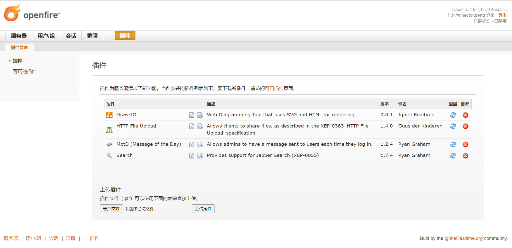

# Openfire 部署

[Prosŏdy IM](https://prosody.im/) 是个 [现代 XMPP](https://modernxmpp.org/) 的通讯服务器。

相比于 Prosody，[Openfire](https://www.igniterealtime.org/projects/openfire/) 更易于部署和配置。

> Openfire 是在开源 Apache 许可证授权下的，实时协作 (real time collaboration, RTC) 服务器。他使用了唯一广泛采用的即时消息开放协议，XMPP，Openfire 非常易于设置和管理，却提供了坚如磐石的安全性和性能。
>
> 
-- ignite realtime

## 安装配置

Openfire 安装配置十分简单，大致分为：

- 数据库 Postgresql 安装配置；

- `default-jre` Java 运行时环境安装：`apt install -y default-jre`；

- Openfire 的安装：`sudo dpkg -i openfire.deb`；

- DNS 记录的建立，如 `im.xfoss.com`；

- 安装过程中连接到 LDAP（AD）域控制器，以使用域账号认证。

随后即可通过 `http://localhost:9090` 进入 Openfire 的配置。配置主要是要为 XMPP 服务配置（泛）域名对应的私钥和证书，以免客户端报出证书错误；以及安装必要插件（`HTTP File Upload`，解决聊天中发送文件问题）。

## `Spark` 客户端

> Spark 是款专为企业和组织优化设计的，开业跨平台即时通讯客户端。他的特点是内置了支持群聊、电话集成以及强大的安全性。他还具有在线拼写检查、群组聊天室书签和标签对话等功能，为最终用户提供了良好的体验。
> 与 Openfire 服务器结合时，Spark 是使用不安全的公共即时通讯网络的最简单、最好方案。
>
> 
-- ignite realtime

> **参考链接**：
>
> - [LDAP authentication](https://jitsi.github.io/handbook/docs/devops-guide/ldap-authentication/)
>
> - [InstallingProsody](https://wiki.debian.org/InstallingProsody)
>
